## Presentation Slides

**[Download PDF](./presentation.pdf)**

# Overview

Hey guys, how you guys doing? \
Since a few days some people asked me what I usually do at work. My answers usually caters differently as the population pool contains juniors, colleagues, seniors, whamens i need to rizz, parents and relatives, etc. \

So I decided, why not write a small write-up for it. At the same time one of my juniors asked me to give a talk on it to a community he is a part of so was like,
why not (this took the whole Saturday and Sunday to compile :sob:).

Also disclaimer, there are hundreds of places where there are different tricks to optimise so we aren’t going to talk about all of that here.
Also this blog should be paired with a good understanding of golang, it would really help but that's the scope of another blog.


# Introduction

This write up will consist of some theory and more examples. We will talk about tools, tricks, ways to write better code.
Additionally, will be adding a GitHub repo at the end so as to refer to the examples and test and verify by your own. \
We will be analyzing our code and trying to make it better step by step. Finding problems would be the first and then trying to solve them.


## Things that bother us

First of all let's get into it. Why do we need to optimise our code? What's the reason? Why is your manager saying to make it as low latency as possible? 

Here comes the word latency. So what is latency? Ask IBM and they will tell it's the delay in a system. And that's true.
Let's say I want some order to execute, due to things being over the network, I/O, heap allocations, etc. I can't get it done on the spot, it will take some time to reach some co-located server and execute stuff there.

So what causes this latency at all? Why is it there? Let's rule out things we don't have in hand and focus on programs coz we only control programs :sob: (I hope you guys write code by your hand)

Things that bug us:
- I/O operations
- Synchronizations
- Heap allocations
- GC Pressure

So what do we want from our programs really? Reduce overhead of I/O operations, reduce heap allocations, lower down GC pressure, etc.


## Basics and its working

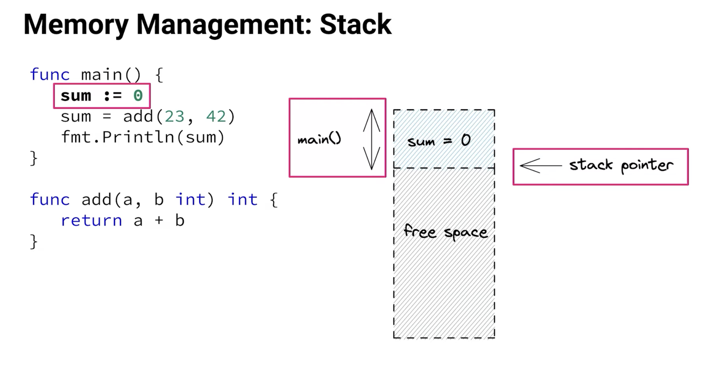

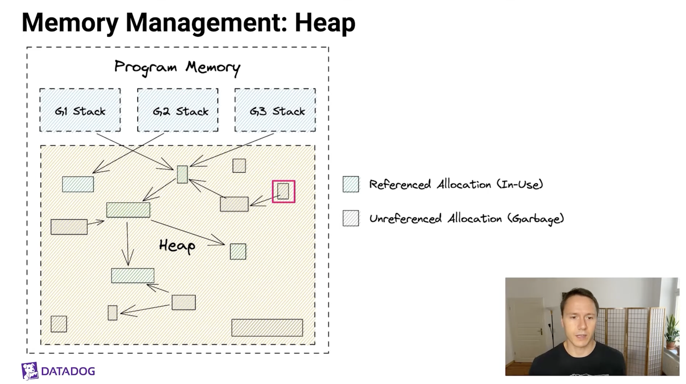

SO essentially when we run a golang project, we allocate sum memory, compute something and output something. Where does all that happen ? Lets take a look at it.

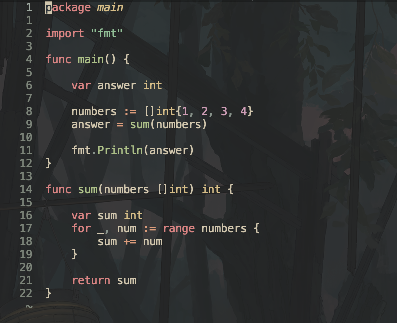

This is a simple golang program, it makes a slice, sends it to compute something and gets back the answer. Pretty cool right.
Now lets read how the whole program flows. For this we will use a golang gui to read assembly called [lensm](https://github.com/loov/lensm)

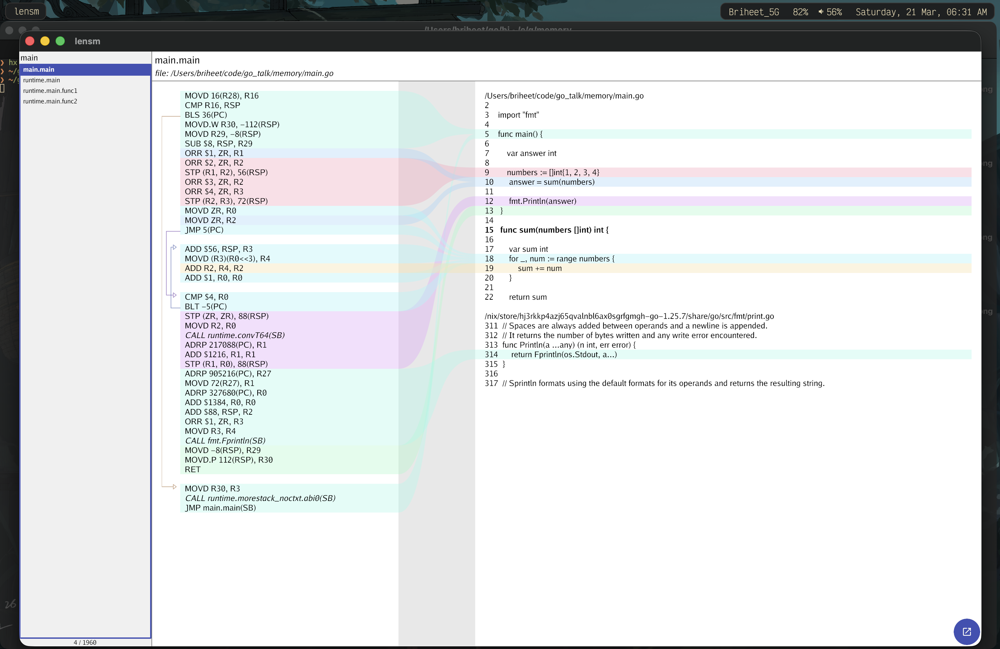

As you can see our program does a lot of things. Let me take you line by line on what it is doing and at the end i will explain you the wholesome way on why something. \
Also make sure i am building and objdumping on apple silicon hence these are arm stuff.

```asm
MOVD 16(R28), R16                    // ldr x16, [x28,#16]
```
MOVD is a Go assembler pseudo-instruction. The core ARM64 MOV instructions from the manual are these.
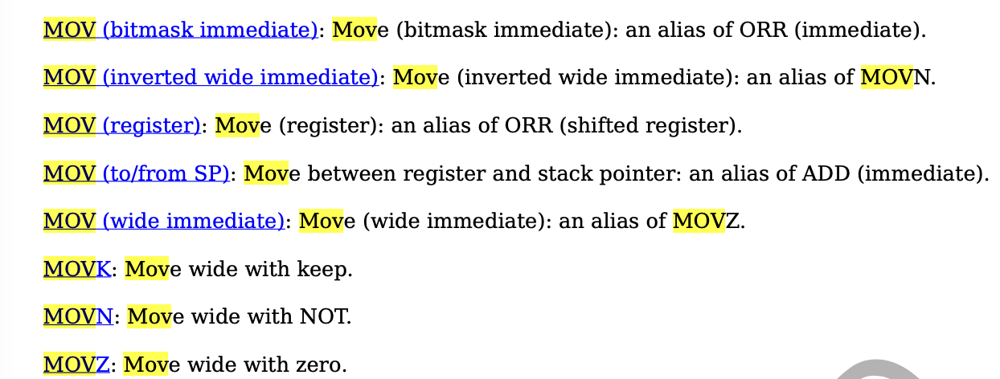

So what golang does is that it implements a bunch of things different from the main instructions.

If you have seen the talk by Rob Pike on how they moved to Go packages for linking
stuff, you will get why golang does this. This also helps in supporting various different machines and keeping it portable. \
This design helps keep the assembler simple, and along with other reasons, Go tends to compile fast. \
Here is the link to the talk if you're interested. [Design of the golang assmebler](https://youtu.be/KINIAgRpkDA?si=VEL23ZQdlsDyYipN)

So you can go to the official package docs: [Official package](https://pkg.go.dev/cmd/internal/obj/arm64)

Golang implements MOV in variants. \
64-bit variant ldr, str, stur => MOVD; \
32-bit variant str, stur, ldrsw => MOVW; \
32-bit variant ldr => MOVWU; ldrb => MOVBU; ldrh => MOVHU; ldrsb, sturb, strb => MOVB; ldrsh, sturh, strh => MOVH. \


So as we are on a 64 bit arm machine, our golang program uses MOVD to load and store. So now you can map
```asm
; 64-bit variant ldr, str, stur => MOVD;
MOVD 16(R28), R16                    // ldr x16, [x28,#16]
```
It goes to function asmout to this switch 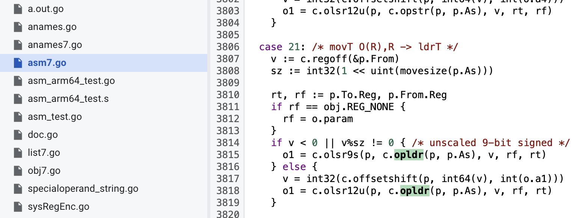 which then calculates offset+size and then checks simm (LDUR) or imm (LDR).
Then when calling c.opldr we get AMOVD which returns base opcodes 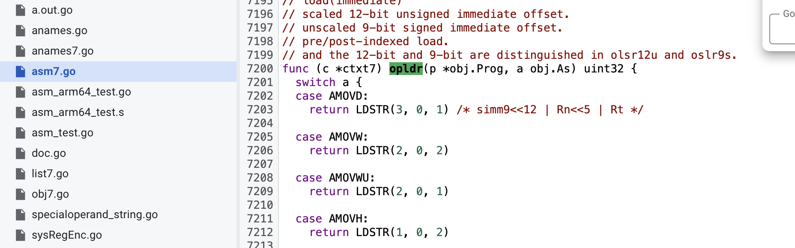 and then we call olsr12u which encodes the imm and sets the unsigned-offset bit (some fuckery I am not that intelligent)
and returns back a uint32 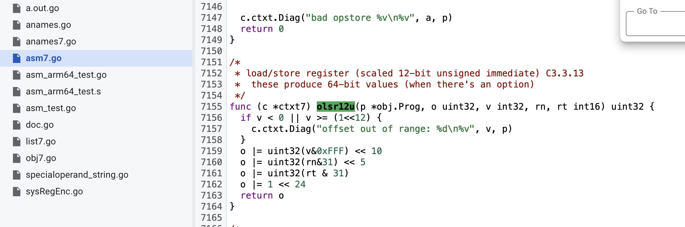

So now you would ask why R28 briheet? If you read the golang assembler manual, you'll see it is reserved by the compiler and linker. If you read the Go ABI, R28 is the current goroutine
pointer. 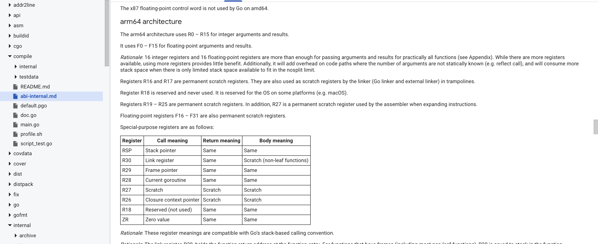

So to summarize, the operation listed below
```asm
MOVD 16(R28), R16                    // ldr x16, [x28,#16]
CMP R16, RSP                         // cmp sp, x16
BLS 36(PC)                           // b.ls .+0x90
```
means that the current main function starts as a goroutine (check R28 is the current goroutine) and during the start it loads g.stackguard0 into R16 (see the Go ABI pic above). Then we use CMP to compare that stack guard limit with RSP (stack pointer) to see if the stack is safe or if we need to grow it.
That’s why you will see there is a branch coming out of BLS below, it calls runtime.morestack_noctxt.abi0(SB) and then jumps back to main.main. 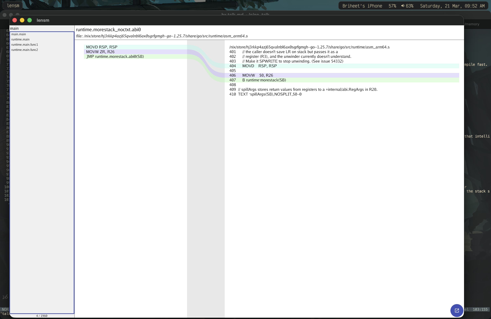

So the flow is:
- R28 = current goroutine (g)
- MOVD 16(R28), R16 loads g.stackguard0
- CMP R16, RSP checks if the current stack pointer is too close to the guard
- If it’s too close, it calls runtime.morestack to grow the goroutine’s stack

As I said, R28 is the current goroutine in the Go ABI screenshot. So how does a goroutine look like or laid out that 16 offset on R28 (current goroutine) gives us the stack guard value?
Here is the runtime stack layout in golang. 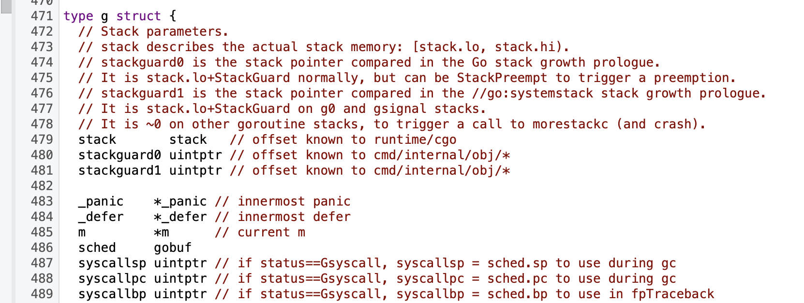 and 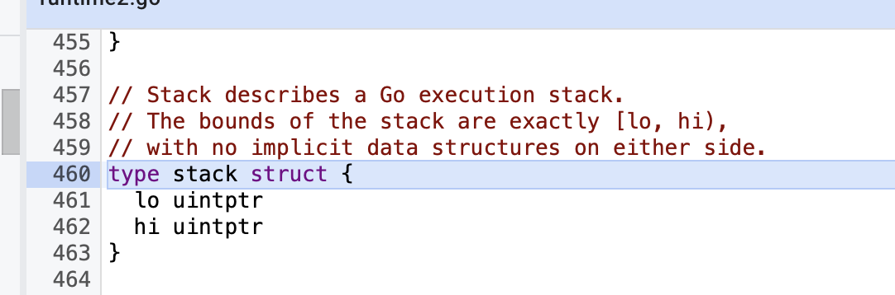

So if you go down with +0, +8 and then +16, wait, there you have +16 on current goroutine (R28) gives you stackguard0.

Hence i think now you can finally understand how instructions are laid out, Go ABI's, offset, asmout, linking, checks at compile time for runtime, program start and more.
This is the 1% you need to know to understand the real depths of performance.
Also for now i am gonna skip explaining all instructions and just write basic stuff as you can figure that out the way i have explained above, or else you should leave programming.
jk ill add them in future.

 
```asm
MOVD.W R30, -112(RSP)                // str x30, [sp,#-112]!
MOVD R29, -8(RSP)                    // stur x29, [sp,#-8]
SUB $8, RSP, R29                     // sub x29, sp, #0x8
```

now we have these calls, but what does it mean. We can now read the abi and know that R30 is Link Register/Return address and RSP is Register stack pointer, but what is -112 and why  ?
Lets look at the stack frame.

```asm
ORR $1, ZR, R1                       // orr x1, xzr, #0x1
ORR $2, ZR, R2                       // orr x2, xzr, #0x2
STP (R1, R2), 56(RSP)                // stp x1, x2, [sp,#56]
ORR $3, ZR, R2                       // orr x2, xzr, #0x3
ORR $4, ZR, R3                       // orr x3, xzr, #0x4
STP (R2, R3), 72(RSP)                // stp x2, x3, [sp,#72]
```

AS we can see that this is our slice building. ORR is a bitwise or operation. On arm64, it helps in loading in Register R1 as bitwise OR with zero is the same number (A OR 0 = A).
Its the golang assembler choosing to move
If i am not wrong MOV is also goes to ORR or ADD on arm. I am not a assembly programmer so no idea.

So essentailly it takes 1 and second immdeiate values and moves both R1 and R2 in stack frame at 56 + register stack pointer.
Then it does the same for next 2 values for moving them into 72 + register stack pointer.
So here we can see that
56 + 8 => 64, 64 + 8 => 72, 72 + 8 => 80, 80 + 8 => 88 \
So thats 88 - 56 = 32; (4 * 8)

Hence we can see that the numbers live at stack frame and according to bytes and we know there starting. \

Now we can see that our slice data occupies offsets 56–88 in the stack frame (32 bytes for 4 int64s). Now lets go ahead.

+Now let’s look at the loop that sums the slice. This is the inlined `sum`:
```asm
MOVD ZR, R0                          ;R0 = 0        (i = 0)
MOVD ZR, R2                          ;R2 = 0        (sum = 0)
JMP 5(PC)                            ;jump to loop to check the condition

ADD $56, RSP, R3                     ;R3 = SP + 56  (base address of the slice backing array)
MOVD (R3)(R0<<3), R4                 ;R4 = *(R3 + R0*8)  (load element i)
ADD R2, R4, R2                       ;sum += element
ADD $1, R0, R0                       ;i++
CMP $4, R0                           ;compare i with 4 (len)
BLT -5(PC)                           ;if i < 4, jump back to loop body
```

So in Go ways, its:

```go
sum := 0
for i := 0; i < 4; i++ {
	sum += numbers[i]
}
```

Why the jump before the loop body? It’s a common pattern: initialize `i` and `sum`, then jump to the condition check, then loop back into the body if `i < 4`.
This prevents executing the body once before the first check.

Why `R0<<3`? Each `int` is 8 bytes on 64‑bit, so `index * 8` gives the byte offset.
[ABI reference](https://tip.golang.org/src/cmd/compile/abi-internal)

Cool, I hope everything is fine till here. I hope you guys understand :), I can just hope.

So now here comes the most weird part.
If you are into systems and have written C++ or Rust code, or even seen the Datadog slide screenshot above, you would be knowing that heap escapes are the worst.
The compiler has to fetch it first and the whole flow takes time.
So when optimising the code we usually keep functions small and inlined (keep functions under cost 80) and reduce escapes to heap. \

But check this out, a normal fmt.Println call does a call to runtime.convT64(SB). Here `(SB)` means the symbol is addressed relative to the Static Base pseudo-register, which is how Go assembly references global symbols and functions. \
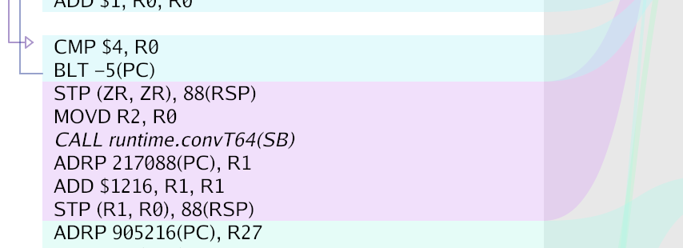

But why here? Turns out that calling fmt.Println(answer) causes interface boxing, which often makes the value escape and triggers a call to runtime.convT64.
Check the implementation of 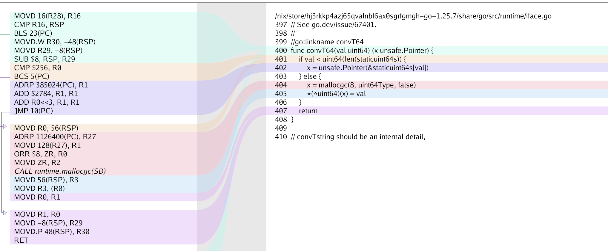
It calls at runtime and gives back a pointer to fmt.Println. But how can we remove this issue?

If you see the implementation of fmt.Println
```go
// It returns the number of bytes written and any write error encountered.
func Println(a ...any) (n int, err error) {
	return Fprintln(os.Stdout, a...)
} 
```
it takes in any and any is an interface, hence what we see here is interface boxing.
To remove this, we would need to write to os.Stdout.WriteString and use the strconv package to convert,
but that also has runtime.StringFormatInt which also has a call to runtime.panicSlice so let's not go that way.

So the point here was we can see interface store at

```asm
STP (ZR, ZR), 88(RSP)                // stp xzr, xzr, [sp,#88]
```

this at +16 as store for interface is value and its pointer. Hence the highest offset used in the frame is 88 + 16 => 104. The remaining 8 bytes (up to the 112-byte frame) account for alignment or other bookkeeping.

## Profiling

# Cpu profilling

CPU profiling is measuring where your program spends CPU time. It records which functions and lines consume the most CPU cycles, so you know what to optimize.

Lets start profiling some code and see what we have. I have added the code for this section on github at [Here](https://github.com/briheet/go_elixir_talk)

So here is our golang program

```go
package main

import (
	"fmt"
	"strings"
	"time"
)

func main() {
	start := time.Now()

	var result string
	result = calculateResult(100_100)

	fmt.Println("elapsed:", time.Since(start))
	fmt.Println("length:", len(strings.Split(result, ",")))
}

func calculateResult(num int) string {

	var result string
	for i := range num {
		result += fmt.Sprintf("item-%d,", i)
	}

	return result
}
```

Looks nice a normal program, but there are places this can we optimised. WHen running go build and ./cpu, we get about 2.7 seconds of time. Lets see this code. \
The first thing is to write good tests for your program so things dont go other ways.

```bash
❯ go run main.go
elapsed: 2.649227084s
length: 100101
```

So our initial runs show about 2.6 seconds of execution. Lets write some tests and check the issue then.
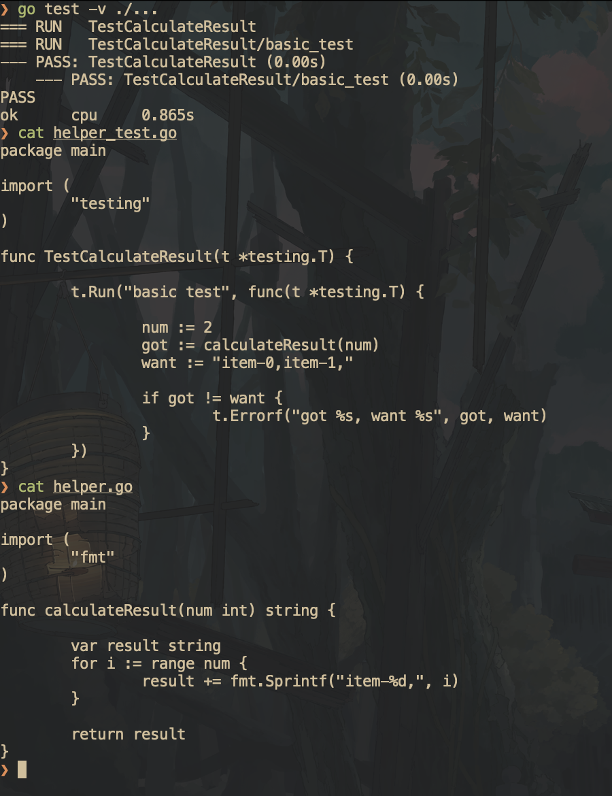

So our simple test runs fine, now lets write some benchmarks. 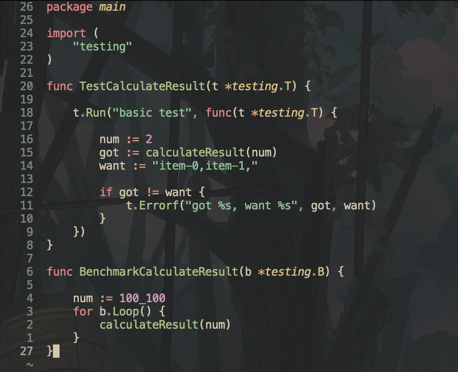

Lets run and check output.

```bash
go test -bench=. -benchmem -benchtime=3s -count=10 -cpuprofile=cpu.pprof -memprofile=mem.pprof > benchmark.txt
```

This is typically a good way to benchmark. Lets me explain
1. -bench=. tells you what functions you want. In this case it tells all. You can also write -bench=<Benchmark-function-name> and it will only benchmark that function.
2. -benchmem tells it to include memory allocation stats in benchmark result.
3. -benchtime= tells it the time for one benchmark to run. By default it is 1 second. You can specify here.
4. -count= tells it the number of times the benchmark needs to be run. The profilers are not determinstic in nature hence its nice to have good sampling and then compare it.
5. -cpuprofile= and -memprofile= indicates the files we want to generate for our profiling to save.

Now i typically save the out by `> benchmark.<benchmark-name>` so that i can use benchstat to compare it in future. Cool lets move further.

This is the output of the benchmark.
```bash
goos: darwin
goarch: arm64
pkg: cpu
cpu: Apple M4 Pro
BenchmarkCalculateResult-12    	       1	3519798417 ns/op	54486608696 B/op	  356902 allocs/op
BenchmarkCalculateResult-12    	       1	3329816625 ns/op	54483367368 B/op	  351092 allocs/op
BenchmarkCalculateResult-12    	       2	2517153625 ns/op	54464683360 B/op	  329897 allocs/op
BenchmarkCalculateResult-12    	       2	2544592792 ns/op	54463985504 B/op	  329037 allocs/op
BenchmarkCalculateResult-12    	       2	2523259521 ns/op	54463806728 B/op	  328832 allocs/op
BenchmarkCalculateResult-12    	       2	2553570208 ns/op	54463119100 B/op	  327607 allocs/op
BenchmarkCalculateResult-12    	       2	2545432750 ns/op	54464322420 B/op	  329436 allocs/op
BenchmarkCalculateResult-12    	       2	2546903666 ns/op	54463173380 B/op	  327862 allocs/op
BenchmarkCalculateResult-12    	       2	2533780854 ns/op	54464302596 B/op	  330191 allocs/op
BenchmarkCalculateResult-12    	       2	2533250021 ns/op	54464358280 B/op	  329840 allocs/op
PASS
ok  	cpu	48.456s
```

Really bad stuff ngl. Lets see our cpu and mem profiling.
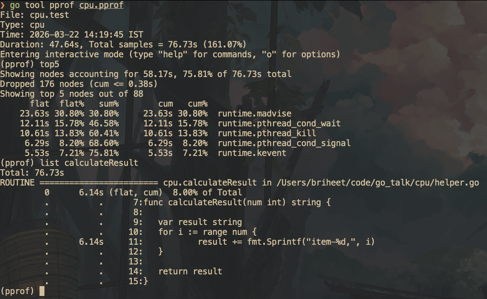
 Its shows funcking 6 seconds on result and this is only 8% of program and i am like what. Lets go inside it.

```zsh
total: 76.73s
ROUTINE ======================== fmt.Sprintf in /nix/store/hj3rkkp4azj65qvalnbl6ax0sgrfgmgh-go-1.25.7/share/go/src/fmt/print.go
         0      170ms (flat, cum)  0.22% of Total
         .          .    237:func Sprintf(format string, a ...any) string {
         .      130ms    238:	p := newPrinter()
         .       20ms    239:	p.doPrintf(format, a)
         .       10ms    240:	s := string(p.buf)
         .       10ms    241:	p.free()
         .          .    242:	return s
         .          .    243:}
         .          .    244:
         .          .    245:// Appendf formats according to a format specifier, appends the result to the byte
         .          .    246:// slice, and returns the updated slice.
```

Now what the duck is a newPrinter() ? Also i can see that 170ms out of 6 seconds tells me fmt.Sprintf is not the bottleneck, there is something fundamentally i am doing wrong. Lets see

```bash
(pprof) list newPrinter
Total: 76.73s
ROUTINE ======================== fmt.newPrinter in /nix/store/hj3rkkp4azj65qvalnbl6ax0sgrfgmgh-go-1.25.7/share/go/src/fmt/print.go
         0      130ms (flat, cum)  0.17% of Total
         .          .    151:func newPrinter() *pp {
         .      130ms    152:	p := ppFree.Get().(*pp)
         .          .    153:	p.panicking = false
         .          .    154:	p.erroring = false
         .          .    155:	p.wrapErrs = false
         .          .    156:	p.fmt.init(&p.buf)
         .          .    157:	return p
(pprof)
```

So actually profiler can hint me enough that neither me function has issues. The issue is on the result line i am not able to understand.
You know what nig, let me fucking open up the assembly view.
Also let me also post memprofile.

```bash
❯ go tool pprof mem.pprof
File: cpu.test
Type: alloc_space
Time: 2026-03-22 14:20:33 IST
Entering interactive mode (type "help" for commands, "o" for options)
(pprof) list calculateResult
Total: 912.98GB
ROUTINE ======================== cpu.calculateResult in /Users/briheet/code/go_talk/cpu/helper.go
  912.70GB   912.97GB (flat, cum)   100% of Total
         .          .      7:func calculateResult(num int) string {
         .          .      8:
         .          .      9:	var result string
         .          .     10:	for i := range num {
  912.70GB   912.97GB     11:		result += fmt.Sprintf("item-%d,", i)
         .          .     12:	}
         .          .     13:
         .          .     14:	return result
         .          .     15:}
(pprof) list Sprintf
Total: 912.98GB
ROUTINE ======================== fmt.Sprintf in /nix/store/hj3rkkp4azj65qvalnbl6ax0sgrfgmgh-go-1.25.7/share/go/src/fmt/print.go
   27.50MB   284.91MB (flat, cum)  0.03% of Total
         .          .    237:func Sprintf(format string, a ...any) string {
         .   256.91MB    238:	p := newPrinter()
         .   512.01kB    239:	p.doPrintf(format, a)
   27.50MB    27.50MB    240:	s := string(p.buf)
         .          .    241:	p.free()
         .          .    242:	return s
         .          .    243:}
         .          .    244:
         .          .    245:// Appendf formats according to a format specifier, appends the result to the byte
```

Woh thats a lot of allocation. The issue is on the line but i cant think of anything better. Lets see in assembly.

```bash
go build -gcflags='-m=2' -o asmcheck .

# AS our function got inlined in main, we check main. You can also add //go:noinline this will make the function we are benchmarking not inline
~/go/bin/lensm -filter 'main.main' asmcheck
```

Now we see the real issue, We are doing 2 runtime calls. But how ? First one is doing boxing interface as we saw in above basic flow section.
Second is we are doing string concatenation which happens as runtime.

1. CALL runtime.convT64(SB) — boxing i into interface{} for fmt.Sprintf's ...any parameter.
2. CALL runtime.concatstring2(SB) — the result +=

So now we can hold of that concatenation does is that it picks up the previous string, and add the new string to it. If you read its code concatString, it takes in a temporary buffer,
and a slice of the 2 strings we have sents and concats them whatever.

Hence now we have to find a better way to concat strings and remove this stuff. Lets google


Hence google says to use strings.Builder. Let me try and see.

```go
package main

import (
	"fmt"
	"strings"
)

func calculateResult(num int) string {

	var sb strings.Builder
	for i := range num {
		sb.WriteString(fmt.Sprintf("item-%d,", i))
	}

	return sb.String()
}
```

```bash
❯ go run .
elapsed: 11.362125ms
length: 100101
```

```bash
	 go test -v ./...
=== RUN   TestCalculateResult
=== RUN   TestCalculateResult/basic_test
--- PASS: TestCalculateResult (0.00s)
    --- PASS: TestCalculateResult/basic_test (0.00s)
PASS
ok  	cpu	1.157s
❯ go test -bench=. -benchmem -benchtime=3s -count=10 -cpuprofile=cpu.pprof -memprofile=mem.pprof > benchmark1.txt
❯ hx benchmark1.txt
❯ benchstat benchmark.txt benchmark1.txt
goos: darwin
goarch: arm64
pkg: cpu
cpu: Apple M4 Pro
                   │  benchmark.txt  │           benchmark1.txt            │
                   │     sec/op      │   sec/op     vs base                │
CalculateResult-12   2545.013m ± 31%   4.488m ± 2%  -99.82% (p=0.000 n=10)

                   │  benchmark.txt   │            benchmark1.txt            │
                   │       B/op       │     B/op      vs base                │
CalculateResult-12   51941.216Mi ± 0%   7.293Mi ± 0%  -99.99% (p=0.000 n=10)

                   │ benchmark.txt │           benchmark1.txt            │
                   │   allocs/op   │  allocs/op   vs base                │
CalculateResult-12     329.6k ± 7%   200.0k ± 0%  -39.33% (p=0.000 n=10)
```

We can see that strings.Builder eliminated the O(n²) copy-on-every-append, cutting time from 2.5s to 4.5ms and memory from 52GB to 7MB. Now lets us check profiling.

```bash
 go tool pprof mem.pprof
File: cpu.test
Type: alloc_space
Time: 2026-03-22 15:03:19 IST
Entering interactive mode (type "help" for commands, "o" for options)
(pprof) list calculateResult
Total: 56.79GB
ROUTINE ======================== cpu.calculateResult in /Users/briheet/code/go_talk/cpu/helper.go
    5.94GB    56.79GB (flat, cum)   100% of Total
         .          .      8:func calculateResult(num int) string {
         .          .      9:
         .          .     10:	var sb strings.Builder
         .          .     11:	for i := range num {
    5.94GB    56.79GB     12:		sb.WriteString(fmt.Sprintf("item-%d,", i))
         .          .     13:	}
         .          .     14:
         .          .     15:	return sb.String()
         .          .     16:}
(pprof) exit
❯ go tool pprof cpu.pprof
File: cpu.test
Type: cpu
Time: 2026-03-22 15:02:43 IST
Duration: 35.99s, Total samples = 38.87s (108.01%)
Entering interactive mode (type "help" for commands, "o" for options)
(pprof) list calculateResult
Total: 38.87s
ROUTINE ======================== cpu.calculateResult in /Users/briheet/code/go_talk/cpu/helper.go
      20ms      2.32s (flat, cum)  5.97% of Total
         .          .      8:func calculateResult(num int) string {
         .          .      9:
         .          .     10:	var sb strings.Builder
         .          .     11:	for i := range num {
      20ms      2.32s     12:		sb.WriteString(fmt.Sprintf("item-%d,", i))
         .          .     13:	}
         .          .     14:
         .          .     15:	return sb.String()
         .          .     16:}
(pprof)
```

Holy moly this is crazy. Pretty nice reduction as compared to above.

Cool, then let me get into my zone. I like only micro/nano stuff with zero allocs.

```bash
❯ go test -bench=. -benchmem -benchtime=3s -count=10 -cpuprofile=cpu.pprof -memprofile=mem.pprof > benchmark2.txt
❯ benchstat benchmark1.txt benchmark2.txt
goos: darwin
goarch: arm64
pkg: cpu
cpu: Apple M4 Pro
                   │ benchmark1.txt │           benchmark2.txt            │
                   │     sec/op     │   sec/op     vs base                │
CalculateResult-12      4.488m ± 2%   1.632m ± 3%  -63.64% (p=0.000 n=10)

                   │ benchmark1.txt │            benchmark2.txt            │
                   │      B/op      │     B/op      vs base                │
CalculateResult-12     7.293Mi ± 0%   5.494Mi ± 0%  -24.66% (p=0.000 n=10)

                   │ benchmark1.txt │           benchmark2.txt            │
                   │   allocs/op    │  allocs/op   vs base                │
CalculateResult-12      200.0k ± 0%   100.0k ± 0%  -49.98% (p=0.000 n=10)
❯ go tool pprof cpu.pprof
File: cpu.test
Type: cpu
Time: 2026-03-22 15:23:12 IST
Duration: 35.90s, Total samples = 41.71s (116.20%)
Entering interactive mode (type "help" for commands, "o" for options)
(pprof) list calculateResult
Total: 41.71s
ROUTINE ======================== cpu.calculateResult in /Users/briheet/code/go_talk/cpu/helper.go
         0      1.51s (flat, cum)  3.62% of Total
         .          .     10:func calculateResult(num int) string {
         .          .     11:
         .          .     12:	var sb strings.Builder
         .          .     13:	for i := range num {
         .      260ms     14:		sb.Write(itemBytes)
         .      1.13s     15:		sb.WriteString(strconv.Itoa(i))
         .      120ms     16:		sb.WriteByte(',')
         .          .     17:	}
         .          .     18:
         .          .     19:	return sb.String()
         .          .     20:}
(pprof) exit
❯ go tool pprof mem.pprof
File: cpu.test
Type: alloc_space
Time: 2026-03-22 15:23:48 IST
Entering interactive mode (type "help" for commands, "o" for options)
(pprof) list calculateResult
Total: 116.77GB
ROUTINE ======================== cpu.calculateResult in /Users/briheet/code/go_talk/cpu/helper.go
         0   116.76GB (flat, cum)   100% of Total
         .          .     10:func calculateResult(num int) string {
         .          .     11:
         .          .     12:	var sb strings.Builder
         .          .     13:	for i := range num {
         .    32.56GB     14:		sb.Write(itemBytes)
         .    84.21GB     15:		sb.WriteString(strconv.Itoa(i))
         .          .     16:		sb.WriteByte(',')
         .          .     17:	}
         .          .     18:
         .          .     19:	return sb.String()
         .          .     20:}
(pprof)
```

This is even better than our first stuff. Essentailly, strings.Buidler has some methods for bytes and we already have some string as static in nature hence preallocate it and
use it.

```go
package main

import (
	"strconv"
	"strings"
)

var itemBytes = []byte{0x69, 0x74, 0x65, 0x6d, 0x2d}

func calculateResult(num int) string {

	var sb strings.Builder
	for i := range num {
		sb.Write(itemBytes)
		sb.WriteString(strconv.Itoa(i))
		sb.WriteByte(',')
	}

	return sb.String()
}
```

We can also do better. Lets see how


```bash
❯ go test -bench=. -benchmem -benchtime=3s -count=10 -cpuprofile=cpu.pprof -memprofile=mem.pprof > benchmark3.txt
❯ go test -v ./...
=== RUN   TestCalculateResult
=== RUN   TestCalculateResult/basic_test
--- PASS: TestCalculateResult (0.00s)
    --- PASS: TestCalculateResult/basic_test (0.00s)
PASS
ok  	cpu	(cached)
❯ benchstat benchmark2.txt benchmark3.txt
goos: darwin
goarch: arm64
pkg: cpu
cpu: Apple M4 Pro
                   │ benchmark2.txt │           benchmark3.txt            │
                   │     sec/op     │   sec/op     vs base                │
CalculateResult-12     1631.9µ ± 3%   827.2µ ± 1%  -49.31% (p=0.000 n=10)

                   │ benchmark2.txt │            benchmark3.txt            │
                   │      B/op      │     B/op      vs base                │
CalculateResult-12     5.494Mi ± 0%   1.048Mi ± 0%  -80.93% (p=0.000 n=10)

                   │ benchmark2.txt  │           benchmark3.txt            │
                   │    allocs/op    │ allocs/op   vs base                 │
CalculateResult-12   100033.000 ± 0%   1.000 ± 0%  -100.00% (p=0.000 n=10)
❯ go tool pprof cpu.pprof
File: cpu.test
Type: cpu
Time: 2026-03-22 16:23:04 IST
Duration: 36.07s, Total samples = 35.37s (98.07%)
Entering interactive mode (type "help" for commands, "o" for options)
(pprof) list calculateResult
Total: 35.37s
ROUTINE ======================== cpu.calculateResult in /Users/briheet/code/go_talk/cpu/helper.go
     440ms      2.91s (flat, cum)  8.23% of Total
         .          .     20:func calculateResult(num int) string {
         .          .     21:
         .          .     22:	bp := bufPool.Get().(*[]byte)
         .          .     23:	buf := (*bp)[:0]
         .          .     24:
         .          .     25:	var intBuf [20]byte
      40ms       40ms     26:	for i := range num {
     180ms      350ms     27:		buf = append(buf, itemBytes...)
      10ms      1.95s     28:		b := strconv.AppendInt(intBuf[:0], int64(i), 10)
      40ms      330ms     29:		buf = append(buf, b...)
     170ms      170ms     30:		buf = append(buf, commaByte)
         .          .     31:	}
         .          .     32:
         .       70ms     33:	result := string(buf)
         .          .     34:	*bp = buf
         .          .     35:	bufPool.Put(bp)
         .          .     36:	return result
         .          .     37:}
(pprof) exit
❯ go tool pprof mem.pprof
File: cpu.test
Type: alloc_space
Time: 2026-03-22 16:23:40 IST
Entering interactive mode (type "help" for commands, "o" for options)
(pprof) list calculateResult
Total: 44.29GB
ROUTINE ======================== cpu.calculateResult in /Users/briheet/code/go_talk/cpu/helper.go
   44.24GB    44.29GB (flat, cum)   100% of Total
         .          .     20:func calculateResult(num int) string {
         .          .     21:
         .    26.99MB     22:	bp := bufPool.Get().(*[]byte)
         .          .     23:	buf := (*bp)[:0]
         .          .     24:
         .          .     25:	var intBuf [20]byte
         .          .     26:	for i := range num {
         .          .     27:		buf = append(buf, itemBytes...)
         .          .     28:		b := strconv.AppendInt(intBuf[:0], int64(i), 10)
         .          .     29:		buf = append(buf, b...)
         .          .     30:		buf = append(buf, commaByte)
         .          .     31:	}
         .          .     32:
   44.24GB    44.24GB     33:	result := string(buf)
         .          .     34:	*bp = buf
         .    24.54MB     35:	bufPool.Put(bp)
         .          .     36:	return result
         .          .     37:}
(pprof)
```

```go
package main

import (
	"strconv"
	"sync"
)

var (
	itemBytes = []byte{0x69, 0x74, 0x65, 0x6d, 0x2d}
	commaByte = byte(0x2c)
)

var bufPool = sync.Pool{
	New: func() any {
		b := make([]byte, 0, 2*1024*1024)
		return &b
	},
}

func calculateResult(num int) string {

	bp := bufPool.Get().(*[]byte)
	buf := (*bp)[:0]

	var intBuf [20]byte
	for i := range num {
		buf = append(buf, itemBytes...)
		b := strconv.AppendInt(intBuf[:0], int64(i), 10)
		buf = append(buf, b...)
		buf = append(buf, commaByte)
	}

	result := string(buf)
	*bp = buf
	bufPool.Put(bp)
	return result
}
```

What the helly, how can you i do this. So essentailly we can use a bufferPool, get the buf, use it to dump items, ints, convert to string with `string(buf)` (a safe copy) and return the buf. I would say
this is not a hot path hence this is a bit overkill but `performance nerds looks for performance everwhere ;)`

TODO: Please add simd stuff here.

So now lets compare with our baseline benchmarks how much we went better.

```bash
❯ benchstat benchmark.txt benchmark3.txt
goos: darwin
goarch: arm64
pkg: cpu
cpu: Apple M4 Pro
                   │  benchmark.txt   │           benchmark3.txt            │
                   │      sec/op      │   sec/op     vs base                │
CalculateResult-12   2545012.8µ ± 31%   827.2µ ± 1%  -99.97% (p=0.000 n=10)

                   │   benchmark.txt    │            benchmark3.txt             │
                   │        B/op        │     B/op      vs base                 │
CalculateResult-12   54464312508.0 ± 0%   1.048Mi ± 0%  -100.00% (p=0.000 n=10)

                   │  benchmark.txt  │           benchmark3.txt            │
                   │    allocs/op    │ allocs/op   vs base                 │
CalculateResult-12   329638.000 ± 7%   1.000 ± 0%  -100.00% (p=0.000 n=10)
```

So lets summarise how much better we went:
1. Time: 2,545ms -> 0.83ms (3,077x faster)
2. Memory: 50.7 GB/op -> 1 MB/op (the single safe string copy)
3. Allocs: 329,600 -> 1 (for concurrent safe code. crazy)

Pretty solid Sunday i guess. I hope my boss doesn't removes me from job :sob. If this was C++, i would've fucked the whole problem to so nanoseconds but ig i am happy till this in go.

So yea, This is a way in which we can improve our cpu and memory stuff. Also working since a year at firms dealing in low latency, this is a ideal scenario. Also you do get paid a good amount
to optimise stuff. So yea this was a whole section on Cpu and mem profiling, benchmarking, flags, benchstat, using assembly, etc.

## Compiler directives

## Tracing and runtime internals
