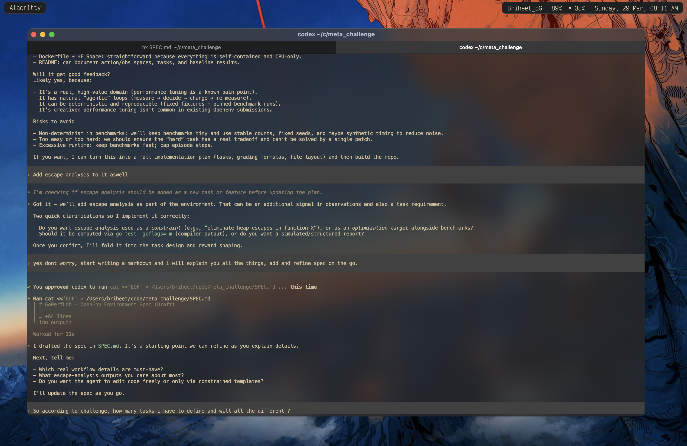

# Intro

Hey, how's it going ? Hope you're doing well.

Yesterday night i was on discord bing chilling with one of my friend when he told me about
this cool hackathon by meta and scaler. I was bored, it was a saturday and i didn't have
anything else to do hence i thought i might give a look wtf is it.

To my suprise, it is so cool. I registered, went through their repo and it was what i was looking for.
For some past days, i have been doing performance work writing low latency systems in golang.
I also have a blog for it. The thing is, it is quite tiresome, needs good scoping in the system
and also a lot of reading and going through stuff.

Also before starting, i am no ML guy hence i would need assistance with python and its
dev environment. Hence for this i will be using codex. I'll try to hand write all things
coz yea python english easy, but yea library stuff can be helped by codex i believe.
Also i am in the hobbyist category so yea pretty fun stuff for a sunday.

## Why RL and how will this help

So i am not a python or machine learning guy, i have very little to do with the ML
world but i genuienly like the way it has transformed my life.
From past some months, i am trying to fit these real world agents into my workflow,
to make myself more efficient.

As a human i can make mistakes reading the numbers, altough we have benchstat in golang.
I can also make wrong assumptions or miss some parameters for optimisations like bytes stuff
or maybe making repeated slices etc.

I this world of agentic coding, i see less people write code by hand. But when checking the codebase
its quite messy, no correct indication, repeated wrong patterns, no profiling, escape analysis, etc

I think this is the place where it can help me to solve this problem.
I think with the current knowledge i have, assmebly checks, and the friendlyness of llms
in writing golang code, i can do something so that we end up writing good, optimised,
better performing code. 

## Starting out

So yea i got into my text editor helix, and started thinking what i want to really do ?
Do i want it to be easy stuff, do i have to be code changes, what should it look like ?
Should it be normal workings, should it be crafted ? IDK. Let me think.

Talking to codex, i get that yea this problem can be modelled well enough with different
problems and rewards.



Also first let me setup the whole repo. I can see that they have provided a good github
repo with nice explaniation [here](https://github.com/raun/openenv-course).
Also, first i have to check what environment we have. As i see we dont have a performance
tunning environment hence lets do that then.

I am thinking about Coding + Git + kernrl. Looks like i can borrow somethings from them and
it should suit a lot.

So here is a current flow i have come up with

```md
We will run a **shared Gitea** service (started once) that hosts pre‑migrated repositories. Each task episode spins up an **isolated workspace** and interacts with Gitea via HTTP API to list repos, clone, and run git commands.

```
┌────────────────────────────────────┐
│ Shared Gitea (start once)          │
│ Port 3000                          │
│ - Pre-migrated repositories        │
└──────────────┬─────────────────────┘
               │ HTTP API
      ┾────────┼────────┾
      │        │        │
  ┌───▼──┐ ┌──▼───┐ ┌──▼───┐
  │Env 1 │ │Env 2 │ │Env 3 │
  │Task A│ │Task B│ │Task A│
  │@abc  │ │@def  │ │@abc  │
  └──────┘ └──────┘ └──────┘
```

Workflow:
- Start Gitea once per container runtime.
- Use a **single canonical repo** for all tasks.
- For each task episode: create a new **git worktree** (isolated workspace), list repos, clone, and run git commands.
- Benchmarks are pre‑defined in the repo; tasks map to specific benchmark targets. 
```

So basically we get the repo, have a worktree setup. parallely execute all benches given and then future steps.
This sounds riduculous but yea we can try something like this. Dont know how will this turn out.
At the end we could have a agent fixing up and a pr to the isolated space. Will be helpful with a locally
deployed model and let it run. At max the only cost is electricity and some compute roughness.

Cool, got the repo sturcture up. I need to start defining my models. 
I see i need to setup my Action, Observation and State for the models.

I thought about it overnight, came up with this for now
```py
class GoPerfAction(Action):
    # Common stuff
    action_type: Literal[
        "git", "benchmarks", "tests", "build_flags", "escape_analysis", "perf", "patch"
    ]

    # Git specific stuff
    git_op: str | None
    git_repo_name: str | None
    git_target_dir: str | None
    git_workspace: str | None
    git_args: List[str] | None

    # Benchmarking specific stuff
    bench_suite: str | None
    bench_mem_required: bool | None
    bench_time: int | None
    bench_count: int | None
    bench_stat: bool | None
    bench_file_name: str | None
    bench_timeout: int | None  # time in seconds
    # TODO: Check if we can somehow automate the profiling data and compare

    # Tests specific stuff
    test_suite: str | None
    test_verbose: bool | None
    test_timeout: int | None
    test_output_save_file: str | None

    # Build flags
    build_flags: List[str] | None

    # Escape analysis
    escape_target: str | None
    escape_flags: List[str] | None
    escape_output_file: str | None

    # Perf analysis
    perf_mode: Literal["stat", "mem", "c2c"] | None
    perf_bench: str | None
    perf_args: List[str] | None
    perf_output_file: str | None

    # Patch
    patch_file: str | None
    patch_diff: str | None


class GoPerfObservation(Observation):
    # Common results
    stdout: str = ""
    stderr: str = ""
    exit_code: int = 0

    # Workspace context
    repo_name: str | None = None
    repo_worktree_path: str | None = None
    repo_git_status: dict | None = None

    # Task metadata
    task_id: str | None = None
    task_goal: str | None = None
    task_step_count: int | None = None
    task_remaining_budget: int | None = None
    task_build_flags: List[str] | None = None

    # Benchmark results
    bench_summary: List[dict] | None = None
    benchstat_summary: dict | None = None

    # Tests
    test_passed: bool | None = None
    test_failures: List[str] | None = None

    # Escape analysis
    escape_summary: List[dict] | None = None
    escape_count_total: int | None = None

    # Perf
    perf_summary: dict | None = None


class GoPerfState(State):
    workspace_path: str | None = None
    repo_name: str | None = None
    repo_revision: str | None = None
    worktree_id: str | None = None

    baseline_metrics: dict | None = None
    current_metrics: dict | None = None

    last_action: dict | None = None
    action_history: List[dict] | None = None

    task_config: dict | None = None
    reward_trace: List[dict] | None = None
    budget_remaining: int | None = None

    build_flags: List[str] | None = None
    perf_artifacts: List[str] | None = None
    escape_artifacts: List[str] | None = None 
```
I think i can make this better, more scoped. But i guess that should be afterwards.
I feel tweaking should be done after we somehow recieve something baseline to work.

Did end up submitting, will complete this next sunday : )
