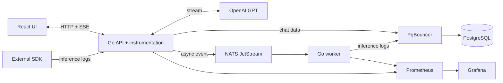
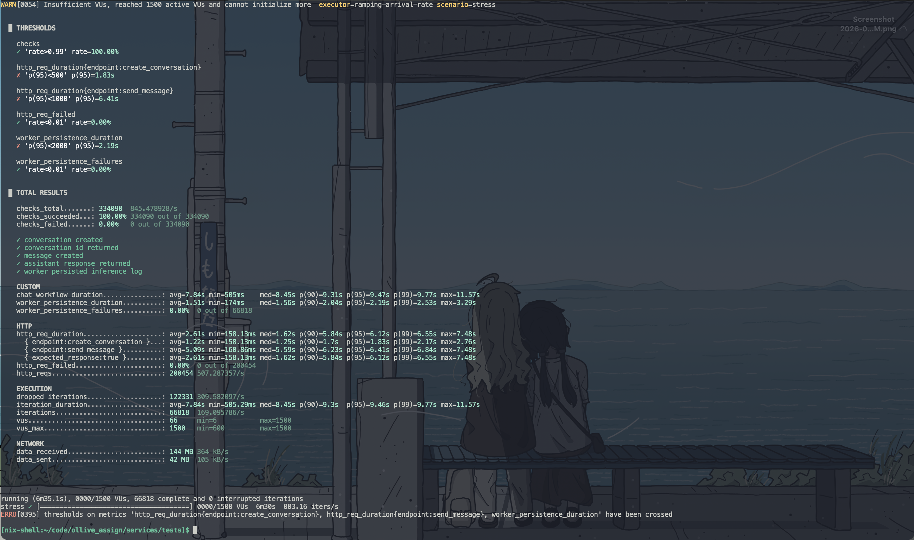
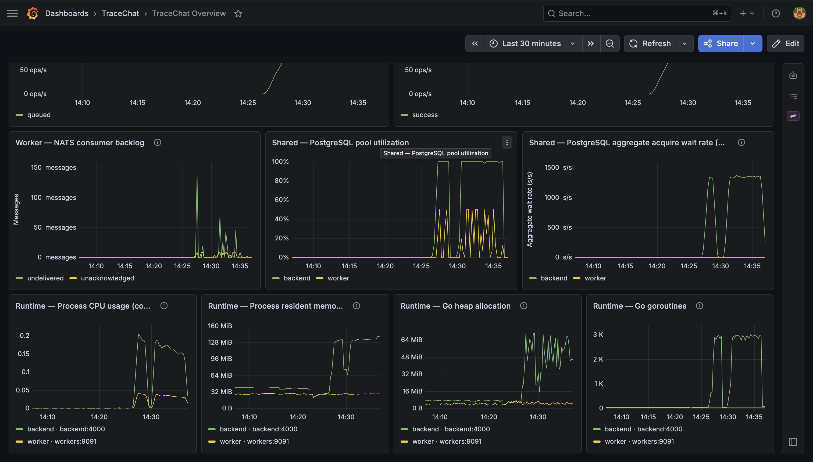
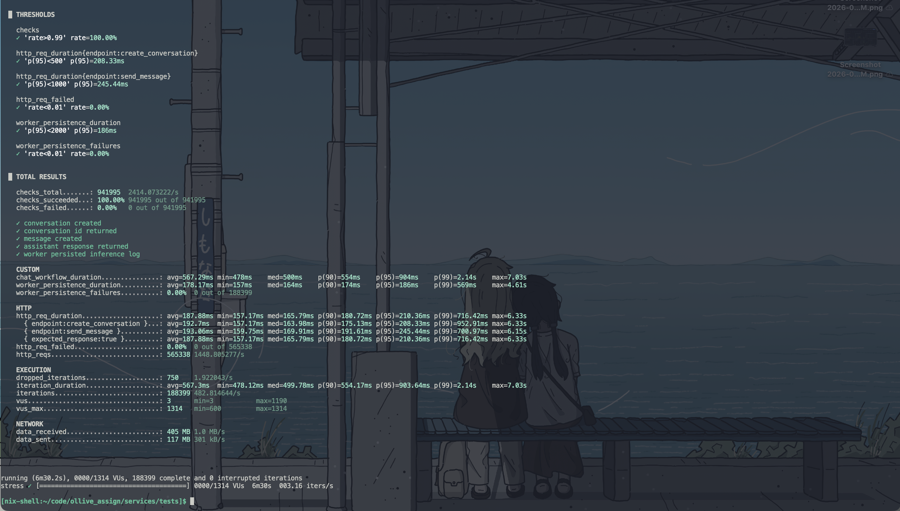
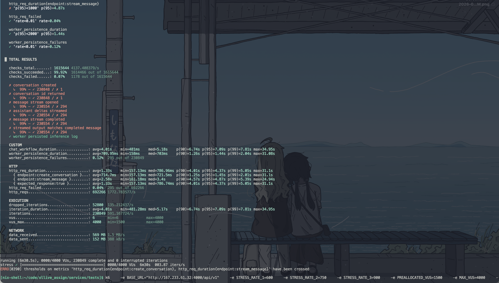
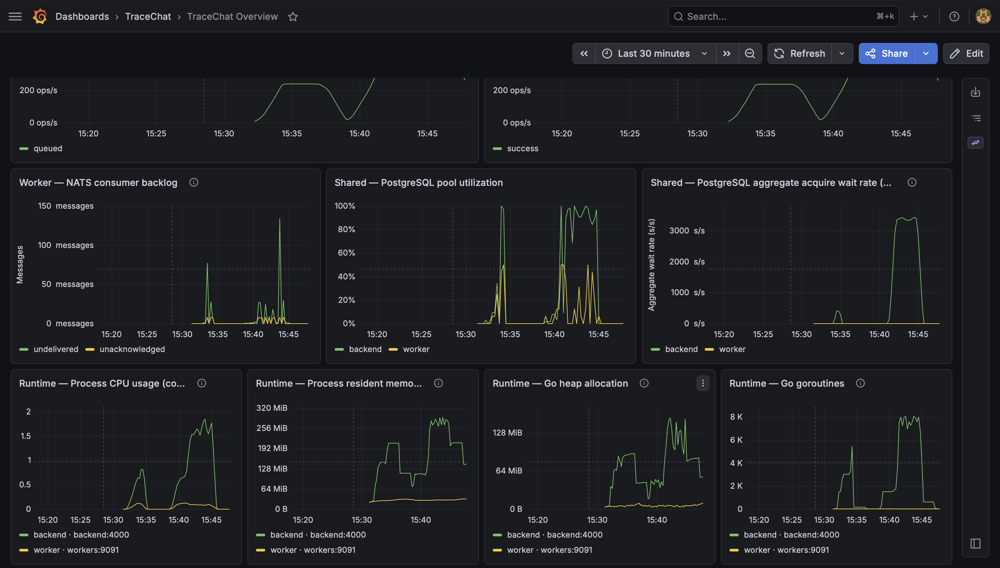

Hey, how's it going ? Hope you're doing well.
Recently, I was working on an assignment which needed to be completed in a single day. While doing that, I found issues while load testing with k6, which ultimately
led to a massive increase in the application's workload performance. Here is how it went.

# Leadup

This was Saturday night. I was checking my emails and, by chance, I saw an email for a founding engineer role with good cash and nice equity. I checked the organisation and really
liked it. So I decided to try it out. The assignment was a simple one: a basic chat UI with inference and logging for multiple providers.

So the next morning, I took it up and started working on it. My initial setup was:

* UI: A basic React application which could talk to some backend.
* Backend: Basic gateway with which the application can talk to in Go.
* NATS: I needed a messaging system to which I could publish async logs so the worker could process them.
* Workers: Takes up messages from configured subject to process, and save to db in Go.
* Postgres: I wanted to keep the application simple hence opted for postgres. Seeing the problem statement i should've gone with clickhouse.
* `Vitest` & `k6`: Language-agnostic tests and `k6` for load testing my application.
* Infra: Nixos-anywhere and deploy-rs was used for final systemd deployment, Docker compose for dev environment.
* Monitoring: `Prometheus` and `Grafana`. Includes monitoring for backend, workers, `NATS`, `PostgreSQL`, and the server.



So yea this was stack i choose to build with. Backend was a domain repository pattern with clients to `NATS` for async publish, `PostgreSQL`, logger as zap from uber, and an AI client for OpenAI,
etc. Worker simply had a orchestrator with configurable workers which had clients for postgres. Tests had a workflow script which would start a workflow, send chat, get stream response back with
SSE and backend call for logs checking in postgres done by workers.
So after somehow building the application end to end, i start load testing on my `Hetzner` VM. Here are the VM configurations:

| Machine | Configuration |
|---|---:|
| Hosting | Single Hetzner KVM VM (about US$16/month) |
| CPU | 4 AMD EPYC-Genoa vCPUs |
| Memory | 7.6 GiB RAM, no swap |
| Disk | 152.6 GiB |
| Deployment | Entire Docker Compose stack on one VM |

# Database Issue

So i started with a basic k6 load testing config. Here is it:
```sh
k6 \
  -e BASE_URL="http://<vm-public-ip>:4000/api/v1" \
  -e STRESS_RATE_1=400 \
  -e STRESS_RATE_2=500 \
  -e STRESS_RATE_3=600 \
  -e PREALLOCATED_VUS=600 \
  -e MAX_VUS=1500 \
  -e STRESS_STAGE_DURATION=1m \
  -e STRESS_HOLD_DURATION=3m \
  run load/stress.js
```

`STRESS_RATE_X` depicts the number of workflows we were doing, which increased little by little over time. `X_VUS` defines the virtual users we had in totality. Also, to have a real workflow,
we had `STRESS_STAGE_DURATION` and `STRESS_HOLD_DURATION`. This would stress for a particular time and then hold at the maximum rate. `k6` adds `VUs` as iterations become slower,
up to the configured ceiling, in an attempt to maintain the requested arrival schedule i.e. `STRESS_RATE_X`.

After the load test ended, i checked out the `Grafana` charts. It showed the backend waiting a lot for `PostgreSQL` connections.
Here is the k6 load test with grafana logs



The results were pretty bad. Here are the results:

| Measurement | Result |
|---|---:|
| Scheduled workflows | 189,149 |
| Completed workflows | 66,818 |
| Dropped workflows | 122,331 |
| Completed share | 35.3% |
| Create-conversation p95 | 1.83 s |
| Send-message p95 | 6.41 s |
| End-to-end workflow p95 | 9.47 s |
| Inference-log visibility p95 | 2.19 s |

Although 100% of checks passed, the system was overloaded. `k6` exhausted all 1,500 `VUs` and dropped 122,331 iterations, meaning nearly two-thirds of the scheduled workload
was never started. The system handled accepted requests correctly but could not sustain the target arrival rate.

## First hypothesis


As you can see there's a spike via backend, a lot of allocation and such which we gather via metrics. At this point our application only used `pgxpool` in a service.
There was no external pooling such as `pgbouncer` used. If you go on youtube and read blogs, a natural thing would be to use `pgbouncer`, allocate pool size at start and all configs
via `pg.ini` which sounds fair. So i ended up adding `pgbouncer`, changing configs and so. 

After this, I ran a test again, but the output was even worse than I imagined. In this run, all `64` database connections were used, and the `aggregate acquire-wait`
rate peaked at roughly `1,374` seconds per second. This shows wait times across all goroutines. Mind you net/http lib send concurrent connections for request handling.
So hundreds or thousands of requests can collectively accumulate far more than one second of waiting. Also, as you can see in `Grafana`, workers only used 8 connections due to the orchestrator
only managing 8 configured goroutines.

## Looking at the data

Looking at the database, repeated load tests had left a realistic amount of data in the VM database:

| Table | Approximate rows during investigation |
|---|---:|
| `conversations` | 279,194 |
| `chat_messages` | 556,870 |
| `inference_logs` | 278,429 |

Still it shouldn't perform so bad. So i ended up checking database queries. Ended up finding the backend endpoint used by k6 to observe worker persistence:

```sql
SELECT ...
FROM inference_logs
WHERE conversation_id = $1
ORDER BY started_at ASC, id ASC
LIMIT $2;
```

The table had indexes for its primary key, start time, and model/status reporting. It did `NOT` have an index beginning with `conversation_id`.

The index inventory at that point was:

```sql
SELECT indexname, indexdef
FROM pg_indexes
WHERE schemaname = 'public'
  AND tablename = 'inference_logs'
ORDER BY indexname;
```

```text
inference_logs_pkey
  CREATE UNIQUE INDEX inference_logs_pkey ON inference_logs (id)

inference_logs_started_at_idx
  CREATE INDEX inference_logs_started_at_idx ON inference_logs (started_at DESC)

inference_logs_model_status_idx
  CREATE INDEX inference_logs_model_status_idx
  ON inference_logs (model, status, started_at DESC)
```

Also i ended up checking the statistics that came from `pg_stat_user_tables`:

```sql
SELECT relname, seq_scan, seq_tup_read, idx_scan
FROM pg_stat_user_tables
WHERE relname = 'inference_logs';
```

```text
    relname     | seq_scan | seq_tup_read | idx_scan
----------------+----------+--------------+----------
 inference_logs |   314372 |  38719034230 |   278430
```
From `seq_scan` and `seq_tup_read`, you can see how repeated scans examined billions of tuples because of the missing index. So many copies of the same scan ran concurrently
and held backend connections while other requests queued behind them.

On a small `testcontainers` or mocking test, this would have been overlooked easily. Scanning small table is cheap and until you're deep in prod one can overlook this until
they spend their time diligently, not like me who was trying to get the best program written in under 8 hours time.
This also explains why `worker_persistence_duration` increased. That k6 metric measures the time from receiving the chat
response until polling can observe the log. It includes backend query and pool wait time. It is not a direct measurement of the worker's `INSERT` duration.

## Fixing this piece

The filter and ordering requirements point directly to the index shape:

```sql
CREATE INDEX CONCURRENTLY inference_logs_conversation_started_at_id_idx
    ON inference_logs (conversation_id, started_at, id);
```

After migration, we checked both the migration state and `PostgreSQL`'s index state:

```sql
SELECT version, dirty FROM schema_migrations;

SELECT c.relname AS index_name, i.indisvalid, i.indisready
FROM pg_index AS i
JOIN pg_class AS c ON c.oid = i.indexrelid
WHERE c.relname = 'inference_logs_conversation_started_at_id_idx';
```

```text
version | dirty
--------+-------
3       | false

index_name                                         | indisvalid | indisready
---------------------------------------------------+------------+-----------
inference_logs_conversation_started_at_id_idx      | true       | true
```

The full repository-shaped query then changed to an index scan:

```text
Limit
  Buffers: shared hit=4
  -> Index Scan using inference_logs_conversation_started_at_id_idx
       Index Cond: (conversation_id = ...)
       Buffers: shared hit=4
Planning Time: 1.406 ms
Execution Time: 0.069 ms
```

The earlier idle plan took about `23 ms` and inspected most of the table. The indexed plan now takes only `0.069 ms` to execute, with `1.406 ms` spent on planning.

## Repeating the load test

The second run completed 188,399 workflows and dropped 750. Here is the output:



```text
checks_succeeded.........................: 100.00% (941995/941995)
http_req_failed..........................: 0.00%   (0/565338)
iterations...............................: 188399  482.81/s
dropped_iterations.......................: 750     1.92/s
http_reqs................................: 565338  1448.81/s
vus......................................: max=1190
vus_max..................................: max=1314
```

The important result is that 99.60% of all scheduled workflows started and completed, compared with 35.3% before the index.

Here is a before and after measurement:

| Measurement | Before index | After index |
|---|---:|---:|
| Scheduled workflows | 189,149 | 189,149 |
| Completed workflows | 66,818 | 188,399 |
| Dropped workflows | 122,331 | 750 |
| Scheduled work completed | 35.3% | 99.60% |
| Create-conversation p95 | 1.83 s | 208.33 ms |
| Send-message p95 | 6.41 s | 245.44 ms |
| End-to-end workflow p95 | 9.47 s | 903.64 ms |
| Inference-log visibility p95 | 2.19 s | 186 ms |
| HTTP failure rate | 0% | 0% |

The index reduced dropped work by 99.39%. Send-message p95 fell from 6.41 seconds to 245 ms, while the end-to-end p95 fell from 9.47 seconds to 904 ms.
Looks pretty good optimisation to me. On to the other...


# Profiling optimisation

After this pretty cool optimisation, I wondered what the profiling would look like.
So now i ran a new k6 bench and recorded its data with new limits. Here is the data:

```sh
k6 \
  -e BASE_URL="http://<vm-public-ip>:4000/api/v1" \
  -e STRESS_RATE_1=600 \
  -e STRESS_RATE_2=750 \
  -e STRESS_RATE_3=900 \
  -e PREALLOCATED_VUS=1500 \
  -e MAX_VUS=4000 \
  -e STRESS_STAGE_DURATION=1m \
  -e STRESS_HOLD_DURATION=3m \
  run load/stress.js
```




The SSE stress profile attempted to ramp from 600 to 900 complete chat workflows per second. It
completed 230,849 iterations, but 52,800 scheduled iterations were dropped after k6 exhausted
4,000 virtual users. The system remained mostly correct, it was mostly correct but the latency was really bad.

| Signal | Result |
|---|---:|
| Conversation creation p95 | 1.45 s |
| Streamed message p95 | 4.87 s |
| Complete workflow p95 | 7.09 s |
| Worker persistence p95 | 1.44 s |
| HTTP failure rate | 0.04% |

This did not look like a container memory limit. `Docker` had no `CPU` or memory quotas, and `Go`'s
heap was small and our worker remained healthy. I ended up checking the Grafana charts and saw pretty bad heap alloc,
paired with huge `CPU` usage and other issues. Here is the screenshot:



So i asked my agents to ssh and get back the `cpu.pprof` and `mem.pprof` from the VM.
This is usually done by `PersistentPreRunE` and `PersistentPostRunE`. Here is the code:

```go
		PersistentPreRunE: func(cmd *cobra.Command, args []string) error {

			if !profile {
				return nil
			}

			f, perr := os.Create("cpu.pprof")
			if perr != nil {
				return perr
			}

			if err := pprof.StartCPUProfile(f); err != nil {
				return errors.Join(err, f.Close())
			}
			cpuProfile = f
			return nil
		},
		PersistentPostRunE: func(cmd *cobra.Command, args []string) error {

			if !profile {
				return nil
			}

			pprof.StopCPUProfile()
			cpuCloseErr := cpuProfile.Close()

			f, perr := os.Create("mem.pprof")
			if perr != nil {
				return errors.Join(cpuCloseErr, perr)
			}

			runtime.GC()
			return errors.Join(cpuCloseErr, pprof.WriteHeapProfile(f), f.Close())
		}, 
```

This usually records the `CPU` profile of the application and the memory profile, which contains allocation and heap information. So, using `go tool pprof`, I jumped into the files to find anything
that i could've missed. Here's something that i found:

## Looking at the data

Backend CPU Profile:
```sh
~/code/ollive_assign/profiles> go tool pprof -top -cum backend-cpu.pprof
File: backend
Build ID: e8b3b692574fd1719d822b6f51f5ba0f7c0aec2d
Type: cpu
Time: 2026-07-19 15:31:03 IST
Duration: 1254.91s, Total samples = 537.27s (42.81%)
Showing nodes accounting for 423.94s, 78.91% of 537.27s total
Dropped 1729 nodes (cum <= 2.69s)
      flat  flat%   sum%        cum   cum%
   372.14s 69.26% 69.26%    372.14s 69.26%  internal/runtime/syscall.Syscall6
     0.09s 0.017% 69.28%    367.25s 68.35%  syscall.Syscall
     0.31s 0.058% 69.34%    366.22s 68.16%  syscall.RawSyscall6
     0.01s 0.0019% 69.34%    276.43s 51.45%  net/http.(*Transport).startDialConnForLocked.func1
         0     0% 69.34%    276.42s 51.45%  net/http.(*Transport).dialConnFor
     0.06s 0.011% 69.35%    275.53s 51.28%  net.(*Dialer).DialContext
     0.10s 0.019% 69.37%    275.26s 51.23%  net/http.(*Transport).dialConn
     0.03s 0.0056% 69.38%    274.39s 51.07%  net/http.(*Transport).dial
         0     0% 69.38%    273.60s 50.92%  net.(*sysDialer).dialParallel
     0.02s 0.0037% 69.38%    273.60s 50.92%  net.(*sysDialer).dialSerial
         0     0% 69.38%    273.57s 50.92%  net.(*sysDialer).dialSingle
     0.01s 0.0019% 69.38%    272.98s 50.81%  net.internetSocket
         0     0% 69.38%    272.97s 50.81%  net.socket
     0.01s 0.0019% 69.38%    272.45s 50.71%  net.(*sysDialer).dialTCP
         0     0% 69.38%    272.44s 50.71%  net.(*sysDialer).doDialTCP (inline)
     0.03s 0.0056% 69.39%    272.44s 50.71%  net.(*sysDialer).doDialTCPProto
     0.04s 0.0074% 69.40%    271.96s 50.62%  net.(*netFD).dial
     0.14s 0.026% 69.42%    271.41s 50.52%  net.(*netFD).connect
     0.01s 0.0019% 69.43%    269.79s 50.21%  syscall.Connect
     0.01s 0.0019% 69.43%    269.78s 50.21%  syscall.connect
     0.38s 0.071% 69.50%    191.68s 35.68%  net/http.(*conn).serve
     0.04s 0.0074% 69.51%    158.83s 29.56%  net/http.serverHandler.ServeHTTP
     0.08s 0.015% 69.52%    158.79s 29.55%  github.com/gorilla/mux.(*Router).ServeHTTP
```

Backend Memory Profile:
```sh
~/code/ollive_assign/profiles> nix-shell -p pprof --run 'pprof -top -sample_index=alloc_space backend-mem.pprof'
File: backend
Build ID: e8b3b692574fd1719d822b6f51f5ba0f7c0aec2d
Type: alloc_space
Time: 2026-07-19 15:51:58 IST
Showing nodes accounting for 31336.79MB, 89.23% of 35118.73MB total
Dropped 436 nodes (cum <= 175.59MB)
      flat  flat%   sum%        cum   cum%
19070.24MB 54.30% 54.30% 20274.89MB 57.73%  github.com/briheet/llm-observability/backend/internal/repository/ai.consumeResponseStream
  649.89MB  1.85% 56.15%   649.89MB  1.85%  bufio.NewWriterSize (inline)
  640.95MB  1.83% 57.98%   640.95MB  1.83%  bufio.NewReaderSize (inline)
  582.16MB  1.66% 59.64%   582.16MB  1.66%  net/textproto.MIMEHeader.Set (inline)
  573.64MB  1.63% 61.27%   579.64MB  1.65%  net/textproto.readMIMEHeader
  549.05MB  1.56% 62.83%  1263.14MB  3.60%  github.com/jackc/pgx/v5/pgconn/ctxwatch.(*ContextWatcher).Watch
  539.66MB  1.54% 64.37%   539.66MB  1.54%  net/http.(*Request).WithContext (inline)
  528.05MB  1.50% 65.87%   528.55MB  1.51%  fmt.Errorf
  524.64MB  1.49% 67.37%   524.64MB  1.49%  net/http.Header.Clone (inline)
  486.55MB  1.39% 68.75%   714.09MB  2.03%  context.AfterFunc
  464.74MB  1.32% 70.08%   619.75MB  1.76%  encoding/json.Marshal
  344.56MB  0.98% 71.06%   392.06MB  1.12%  context.(*cancelCtx).propagateCancel
  324.09MB  0.92% 71.98%   324.09MB  0.92%  github.com/jackc/pgx/v5.(*Conn).getRows
```

Backend Memory Profile Cumulative:
```sh
/code/ollive_assign/profiles> nix-shell -p pprof --run 'pprof -top -cum -sample_index=alloc_space backend-mem.pprof'
File: backend
Build ID: e8b3b692574fd1719d822b6f51f5ba0f7c0aec2d
Type: alloc_space
Time: 2026-07-19 15:51:58 IST
Showing nodes accounting for 31336.79MB, 89.23% of 35118.73MB total
Dropped 436 nodes (cum <= 175.59MB)
      flat  flat%   sum%        cum   cum%
       8MB 0.023% 0.023% 32634.19MB 92.93%  net/http.(*conn).serve
      37MB  0.11%  0.13% 31240.61MB 88.96%  github.com/gorilla/mux.(*Router).ServeHTTP
         0     0%  0.13% 31240.61MB 88.96%  net/http.serverHandler.ServeHTTP
   28.50MB 0.081%  0.21% 30363.42MB 86.46%  github.com/briheet/llm-observability/backend/internal/metrics.(*Metrics).Middleware-fm.(*Metrics).Middleware.func1
         0     0%  0.21% 30363.42MB 86.46%  net/http.HandlerFunc.ServeHTTP
         0     0%  0.21% 30327.41MB 86.36%  github.com/briheet/llm-observability/backend/internal/api.(*API).cors-fm.(*API).cors.func1
   19.50MB 0.056%  0.26% 27112.71MB 77.20%  github.com/briheet/llm-observability/backend/internal/api.(*API).streamMessage
   64.01MB  0.18%  0.45% 26506.51MB 75.48%  github.com/briheet/llm-observability/backend/internal/services.(*ConversationService).StreamMessage
      51MB  0.15%  0.59% 22758.50MB 64.80%  github.com/briheet/llm-observability/backend/internal/sdk.(*InstrumentedCompletion).Stream
      29MB 0.083%  0.67% 21678.66MB 61.73%  github.com/briheet/llm-observability/backend/internal/repository/ai.(*OpenAIRepository).Stream
19070.24MB 54.30% 54.98% 20274.89MB 57.73%  github.com/briheet/llm-observability/backend/internal/repository/ai.consumeResponseStream
         0     0% 54.98%  2112.15MB  6.01%  github.com/jackc/pgx/v5.(*Conn).Exec
```

So you can clearly see the issue. Our backend made around `34.3 GiB` of cumulative allocations, with the `consumeResponseStream` function alone accounting for about 19 GiB flat. This was the issue causing allocation
spikes as we see in our `Grafana` dashboard. Also, if you check the `CPU` profile, `51%` of our total `CPU` time was spent on `net/http.(*Transport).startDialConnForLocked.func1`.
This was due to our `net/http` client constantly creating new connections. Also, taking a closer look, `consumeResponseStream` was allocating a `64 KiB` buffer for every inference.

```go
scanner.Buffer(make([]byte, 64<<10), 1<<20)
```

## Fixing the issue

Hence, adding a clone of `http.Transport` and sharing it via one `http.Client` fixed it. Also, to manage buffers, we used `sync.Pool` and added `bufferLimit`.

```go
const (
	streamInitialBufferSize = 4 << 10
	streamMaxEventSize      = 1 << 20
)


var streamBufferPool = sync.Pool{New: func() any {
	buffer := make([]byte, streamInitialBufferSize)
	return &buffer
}} 
```

## Repeating the load test

The optimized deployment was tested with the same 600 → 750 → 900 workflows-per-second schedule,
the same stage durations, and the same 4,000-VU ceiling.


### k6 before and after

| Signal | Before | After | Change |
|---|---:|---:|---:|
| Completed iterations | 230,849 | 283,545 | +22.8% |
| Dropped iterations | 52,800 | 104 | -99.8% |
| Successful checks | 99.92% | 100% | All checks passed |
| Conversation creation p95 | 1.45 s | 200.62 ms | -86.2% |
| Streamed message p95 | 4.87 s | 377.94 ms | -92.2% |
| Complete workflow p95 | 7.09 s | 932.26 ms | -86.9% |
| Worker persistence p95 | 1.44 s | 196 ms | -86.4% |
| HTTP failure rate | 0.04% | 0% | No failed requests |
| Average completed workflows/s | 591.17 | 725.36 | +22.7% |
| Maximum active VUs | 4,000 | 1,589 | -60.3% |

The arrival-rate schedule requested approximately 283,650 iterations. The optimized system
completed 283,545 and dropped only 104, delivering more than 99.96% of the scheduled work. It no
longer exhausted the configured VU ceiling, and every latency and failure threshold passed.

Pretty cool. This was now comfortable, so I tried pushing it further.
Trying out `1,050 workflows per second`. Here is the output:

```sh
k6 \
  -e BASE_URL="http://<vm-public-ip>:4000/api/v1" \
  -e STRESS_RATE_1=1050 \
  -e STRESS_RATE_2=1050 \
  -e STRESS_RATE_3=1050 \
  -e PREALLOCATED_VUS=4000 \
  -e MAX_VUS=5500 \
  -e STRESS_STAGE_DURATION=1m \
  -e STRESS_HOLD_DURATION=3m \
  run load/stress.js
```

It scheduled approximately 362,400 workflows, completed 362,297, and dropped 102. The remaining
one-workflow difference is rounding in the arrival schedule. All configured thresholds passed;
160 worker-persistence checks timed out, representing 0.04% of completed workflows, while HTTP
requests had a 0% failure rate.

| Signal | Original failing run | Optimized fixed 1,050/s | Improvement |
|---|---:|---:|---:|
| Completed iterations | 230,849 | 362,297 | **+56.9%** |
| Dropped iterations | 52,800 | 102 | **-99.8%** |
| Successful checks | 99.92% | 99.99% | All thresholds passed |
| Conversation creation p95 | 1.45 s | 293.02 ms | **-79.8%** |
| Streamed message p95 | 4.87 s | 770.01 ms | **-84.2%** |
| Complete workflow p95 | 7.09 s | 2.17 s | **-69.4%** |
| Worker persistence p95 | 1.44 s | 998 ms | **-30.7%** |
| HTTP failure rate | 0.04% | 0% | **-100%** |
| Average completed workflows/s, including ramps | 591.17 | 928.24 | **+57.0%** |
| Maximum active VUs | 4,000 | 3,514 | **-12.2%** |


## Total comparison

Here is the total comparison between the first and the latest runs. Pretty nice improvements:

| Backend or worker signal | Before | Optimized 900/s profile | Fixed 1,050/s | 1,050/s vs before |
|---|---:|---:|---:|---:|
| Backend PostgreSQL connections acquired | 64 | 23 | 96 | Reached the new ceiling |
| Backend aggregate acquire-wait rate | 3,480.69 s/s | 3.20 s/s | 62.12 s/s | **-98.2%** |
| Backend CPU | 2.05 cores | 0.61 cores | 0.63 cores | **-69.2%** |
| Backend resident memory | 304.5 MB | 120.5 MB | 214.3 MB | **-29.6%** |
| Backend goroutines | 8,080 | 1,888 | 4,527 | **-44.0%** |
| Worker PostgreSQL connections acquired | 8 | 8 | 8 | No increase |
| Worker aggregate acquire-wait rate | 0.00083 s/s | 0.00252 s/s | 0.00120 s/s | Still negligible |
| NATS pending messages | 134 | 15 | 1,829 | Temporary backlog; later drained |
| NATS acknowledgement-pending messages | 8 | 8 | 8 | Bounded by worker concurrency |
| Backend HTTP request-rate peak | 2,440.90/s | 2,706.60/s | 4,371.97/s | **+79.1%** |
| Inference p95 peak | 366.46 ms | 95 ms | 95 ms | **-74.1%** |
| Time-to-first-token p95 peak | 310.74 ms | 9.72 ms | 19.81 ms | **-93.6%** |

This was nice. So you might ask how much it really impacts theoretically in the real world. So
* For 600-900: The workflow rate was `591.17/s`. This means if someone does 1 message per/min, it could handle about 35k users.
* For 1,050: The workflow rate was `928.24/s`. This means if someone does 1 message per/min, it could handle about 55-60k users.

That is a pretty significant bump considering how little we did. Also, let's only analyse `1,050` workflows.
* One message every 30 seconds: 31,500 active users
* One message every minute: 63,000 active users
* One message every five minutes: 315,000 active users

That's really cool.

So our end performance with vm configs comes down to:

| Machine | Configuration |
|---|---:|
| Hosting | Single Hetzner KVM VM (about US$16/month) |
| CPU | 4 AMD EPYC-Genoa vCPUs |
| Memory | 7.6 GiB RAM, no swap |
| Disk | 152.6 GiB |
| Deployment | Entire Docker Compose stack on one VM |

| Result | Value |
|---|---:|
| Completed workflows | 362,297 |
| Average achieved throughput | 928.24 workflows/s |
| Total HTTP throughput | 2,941.72 requests/s |
| Create-conversation p95 | 293.02 ms |
| Streaming-message p95 | 770.01 ms |
| Worker persistence p95 | 998 ms |
| HTTP failure rate | 0.00% |
| Worker persistence failure rate | 0.04% |
| Dropped iterations | 102 |

# Conclusion

I ended up submitting this, the interview went pretty great. Here is the Read AI summary about it:

Briief overview of backend architecture and worker design for conversation/inference system.
• Uses domain repository pattern for interchangeable stores
• Worker orchestrator: 8 goroutines consuming `NATS JetStream`
• Load test: `928 workflows/s`; ~1,050 `VUs` on a `4-vCPU`/`8-GB` VM
• Estimated capacity: ~55k–60k concurrent users (1 msg/min)
• `PostgreSQL` was the bottleneck; the index cut query execution time from `23 ms` to `0.069 ms`
• PI redaction: worker-side or dedicated service; shorten retention

Really liked the interviewer. Asked me to show code for all things end to end, questioned file persistence, async ack, worker ack, term, nak and how retries will be handled.
Also asked how would i do remaining things and so. Overall was one of the best interviews i felt giving.
