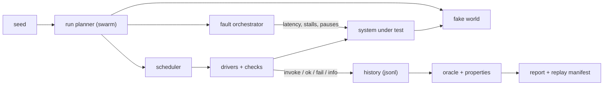
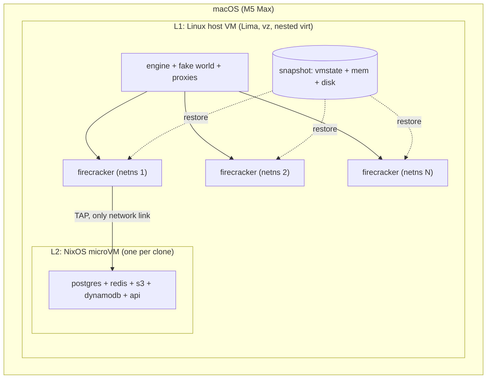
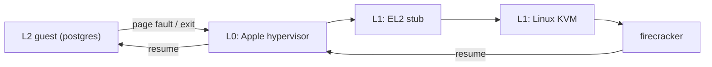

# Intro

Hey, how's it going ? Hope you're doing well. \
So lately i have been building a deterministic simulation testing harness for backend services. Bunch of systems, seeded workloads, injected faults and properties checked at the end.
Did some research experimentation around it which went from "this is amazing" to "why is my macbook dying" to "ok this is actually amazing" in a single day. So here is the whole log of it.

This one is long, has a lot of tables and numbers. Grab a coffee :sob:

# Why i wanted this

The key ingredient for deterministic simulation testing on system imo is a sealed machine which can be snapshotted and forked.
Every test run starts from a byte-identical state, and many runs branch from one booted system. I wanted exactly that shape:

1. **Boot** the system under test once (Postgres, Redis, an API) inside a microVM.
2. **Snapshot** it.
3. **Restore** a fresh clone per seed, and run many seeds in parallel.

Constraints were simple. Dev happens on MacBooks, CI and scale out will be Linux and i wanted one runtime and one snapshot format for both.
That led me to **Firecracker on KVM**:
- Its native on Linux.
- On macOS it runs inside one Linux VM, using Apple's nested virtualization (M3 or later, macOS 15 or later).
- Snapshot/restore is first class and restored memory can be shared copy-on-write between clones.

So the question this post answers is: **does nested Firecracker on a Mac actually give you fast, concurrent restores ?** \
Spoiler, yes. But not the way the docs default gives you.

# The bigger picture (architecture)

Before jumping into numbers, let me explain what this whole thing is for, coz otherwise snapshots alone dont make much sense.

## What prior art says

I read through a lot of stuff before designing this. Antithesis, FoundationDB's simulation, TigerBeetle's VOPR and Vortex, Jepsen, Maelstrom, Shadow, Hermit, Toxiproxy, Litmus, yade yade yada.
Pretty much all of them agree on a few things:

| idea | from | what it means for us |
|---|---|---|
| Faults are composable families, randomized per seed | FoundationDB, VOPR | config declares allowed families + bounds, engine picks the mix per seed |
| Safety, then heal, then liveness | VOPR, Jepsen | convergence checks run after faults stop |
| Fault proxy on every service → dependency edge | TigerBeetle Vortex, Toxiproxy | latency, stalls, resets per edge |
| Harness owned fakes, no internet | Maelstrom | a "fake world" for every external host, seeded and scripted |
| Indeterminate outcomes | Jepsen | a timeout is recorded as "maybe happened", not as a failure |

Jepsen's `info` outcome is the thing i really liked. If a request times out you dont know whether it happened, and pretending you do is how you get fake bugs.

## The three layers

The design splits into three commands, each owning a different layer:

| command | layer | owns | lifetime |
|---|---|---|---|
| `infra-up` / `infra-down` | Environment | deps (Postgres, Redis, S3, DynamoDB), the fake world, the fault layer, egress denied | long lived |
| `sut` | SUT build | fetch project at a ref, build, migrate + seed into a template, verify readiness | when code changes |
| `run <seed>` | Engine | restore fresh state → boot SUT → setup checks → drivers + faults → heal → liveness checks → report | one seed |

The rule which makes this safe is: **every run gets fresh state.** Fresh DB, fake world ledger reset, proxies healed, fresh SUT process. \
On the host (process mode) i get this with Postgres `CREATE DATABASE … TEMPLATE …`. But i wanted VM snapshots, and thats exactly what this experiment is about.



The honest limit here: without a deterministic hypervisor, BEAM and Postgres cant be replayed bit for bit. Hermit and Shadow both struggle with complex runtimes.
So the contract is **the seed reproduces the schedule** (operations, args, faults, fake responses) and **every run keeps a full trace**. Not perfect replay, but pretty close to useful.

## Runtime: Firecracker + NixOS guests

So the decision was a sealed microVM per run, built on Firecracker with NixOS guest images.



On Linux CI there is no host VM, the same engine binary talks to Firecracker directly and boots the same NixOS image. So the code path is identical on both.

Why Firecracker:
- Native on Linux, snapshots are first class, and it has APIs for pause/resume and rate limits.
- Hard hermeticity, the guest's only NIC is the engine's TAP.
- Whole machine faults for free (pausing a whole VM is a nice GC freeze analogue).
- KVM is where any future deterministic hypervisor work would happen. Apple's hypervisor is a dead end for that.

What it doesnt give is bit-exact replay of thread/interrupt interleaving. Thats a research track for another day.

Cool, now lets get into the actual experiment.

# The setup

| layer | what |
|---|---|
| Hardware | Apple **M5 Max**, 18 cores, 48 GB RAM, macOS **26.6.2** |
| L1, the Linux host VM | **Lima 2.2.0**, `vmType: vz`, `nestedVirtualization: true`; Ubuntu 24.04 aarch64, kernel **6.8.0-142-generic**; **10 vCPU, 24 GiB RAM**, 120 GiB disk; Determinate Nix |
| VMM | **Firecracker 1.16.1** (nixpkgs) for round 1, **Firecracker 1.17.0** (release binary) for the rest |
| L2, the microVM guest | NixOS built with **microvm.nix**, guest kernel **6.18.54**; **2 vCPU, 1024 MiB**; read-only EROFS nix store image + 2 GiB ext4 data volume; **PostgreSQL 14** with `fsync=off` |
| Network | one TAP per microVM, each clone in **its own network namespace** with an identical TAP (host 10.77.0.1, guest 10.77.0.2) |

The Lima VM sees `/dev/kvm`, which confirms nested virt works:

```yaml
# lima.yaml (excerpt)
vmType: vz
nestedVirtualization: true
cpus: 10
memory: 24GiB
```

Building the guest image (kernel + initrd + EROFS store + firecracker config) with Nix inside the Lima VM took **1 min 48.6 s** on first build. Nix things :)

## What i measured

One script, `spike.sh`, does everything:
1. Cold boots the guest.
2. Writes a marker row into Postgres and runs `CHECKPOINT`.
3. Pauses the VM and takes a **full snapshot**, VM state plus guest memory, with a copy of the data disk taken while paused.
4. Restores clones, each into a fresh `firecracker` process in a fresh netns, with its own copy of the data disk.

For each clone i record when `PUT /snapshot/load` returns, when the guest answers ping, and **when `SELECT v FROM marker` returns the row written before the snapshot.** \
That last one is the number that matters. A restored, working database. Everything else is vibes.

Restore call with the File backend (the default):

```json
PUT /snapshot/load
{"snapshot_path": ".../vmstate",
 "mem_backend": {"backend_type": "File", "backend_path": ".../mem"},
 "resume_vm": true}
```

# Round 1: it works funking somehow it doesnt

## Snapshot and single restore: great

| metric | value |
|---|---|
| Cold boot → Postgres ready | 53.3 s (first run); 73.2 s and 76.3 s later |
| Pause + full snapshot | **424–546 ms** |
| Snapshot size | VM state **36 KB**, memory **1.0 GiB**, data disk **34 MB** used |
| `snapshot/load` returns | **14–18 ms** |
| Guest answers ping | **72–95 ms** after load started |
| Marker row readable (one clone) | **+1.36 s to +2.22 s** |

A working, restored Postgres in about 1.5 seconds from a 1 GiB snapshot. Exactly what i hoped for. I was pretty happy at this point ngl.

## Concurrent restores: catastrophic

Then i restored 8 clones from the same snapshot at once:

| N concurrent | `snapshot/load` | ping OK | marker readable | all ready |
|---|---|---|---|---|
| 8 (first attempt) | 16–46 ms | — | **69.9–87.9 s** | 102.8 s |

Every clone loaded in milliseconds, and then took over a minute to answer one query. :sob: \
All 8 returned the correct marker row eventually. Host VM memory stayed at **961 MiB used of 23,980 MiB**, so the clones were sharing pages fine. Something else was wrong.

# Chasing the wrong suspects

I went through a bunch of hypotheses before finding the real one. Writing all of them down coz each one looked very plausible at the time.

**1. A stale ARP cache.**
- *Theory:* each clone's netns creates a new TAP with a random MAC, but the guest's ARP cache, frozen in the snapshot, still points the gateway at the old MAC. Replies get dropped until the entry expires.
- *What i did:* gave every netns's TAP the same fixed MAC.
- *Result:* 69.3–78.2 s for 8 clones (all ready in 89.7 s). **No real change.** Fixed MACs are still the right thing for snapshot clones, just not the bottleneck.

**2. TCP SYN backoff in my own probe.**
- *Theory:* ~70 s is suspiciously close to Linux's SYN retransmit schedule (1 + 2 + 4 + 8 + 16 + 32 s). If the first SYN after restore is dropped, `psql` with no connect timeout sits in backoff, so i'd be measuring my probe and not the VM.
- *What i did:* added `PGCONNECT_TIMEOUT=1` and a ping probe. The single restore guest answered ping **75 ms** after load.
- *Result:* network was not the problem. The concurrent case then crashed my script (a clone exceeded the probe timeout under `set -e`), which was my bug lol.

**3. Plain contention.** With the probe fixed, here is a clean scaling series:

| N concurrent | ping OK | marker readable (after ping) | all ready | host VM memory |
|---|---|---|---|---|
| 1 | 72–95 ms | +1.36–1.85 s | — | — |
| 3 | 204–340 ms | **+12.5–13.4 s** | 14.2 s | 818 MiB |
| 4 | 540–701 ms | **+25.1–26.1 s** | 27.4 s | 867 MiB |
| 8 | 390–2,398 ms | **+160.1–166.8 s** | 168.4 s | 974 MiB |

Thats **strongly superlinear**. 1 clone ≈ 1.5 s, 4 ≈ 25 s, 8 ≈ 165 s. Sampling the host VM during the N=4 run:
- **every `firecracker` process sat at about 100% CPU**;
- `vmstat` showed roughly **40% of CPU time as "guest" time**, with 56–78% idle;
- memory, swap and disk were all idle.

So the guests themselves were spinning.

**4. A clock jump after restore.**
- *Theory:* the guest wakes up with a stale clock and the kernel spends time catching up.
- *What i did:* restored a single clone **60 seconds** after taking the snapshot.
- *Result:* load 18 ms, ping 72 ms, marker **+1.36 s**. Exactly as fast as an immediate restore. Not the clock.

**5. Cross vCPU waits (2 vCPUs per guest).**
- *Theory:* a vCPU spinning at 100% is classic "waiting for the other vCPU" behaviour, made worse when inter-processor interrupts are slow under nesting.
- *What i did:* rebuilt the guest with **1 vCPU**.
- *Result:* N=4: +20.9–22.3 s after ping (all ready 23.2 s). N=8: +127.8–152.0 s, and **3 of 8 never answered** within 180 s. **Same disease.**

At this point i stopped poking at things randomly and went to read how Apple's nested virt actually works.

# What's actually going on

**Apple's nested virtualization runs the inner hypervisor in a constrained mode.** Apple's implementation (macOS 26 on M3 and later) supports only **nVHE** for the L1 hypervisor, with VNCR acceleration and the interrupt controller is Apple's platform vGIC.
So when the Linux VM's KVM runs a Firecracker guest:
- every exit from that guest goes guest → Apple's hypervisor → the Linux VM's EL2 stub → the Linux kernel, and back;
- some EL2 register and interrupt controller accesses trap all the way to Apple.



**A Firecracker restore is a storm of exactly those exits.** With the default File backend:
- guest memory is a lazy `MAP_PRIVATE` mapping of the snapshot file;
- every first touch of a 4 KiB page is a fault;
- every first write to a page is a copy-on-write, which means a page table update and TLB maintenance.

And a restored Postgres touches a lot of memory. The backend fork, shared buffers, catalog caches and so.

**Why it gets superlinear (hypothesis).** Apple's L0 is a black box, so i cant see inside it. But when KVM itself is the outer hypervisor, the documented behaviour fits the numbers pretty well:
- it keeps a small number of shadow stage-2 page tables per vCPU;
- many inner VMs cause constant teardown and TLB flushes;
- frequent memory notifier events (which copy-on-write across clones produces a lot of) invalidate shadow tables wholesale.

All the symptoms line up. High guest time, one vCPU thread pinned per VMM, memory/swap/disk idle, and cost growing faster than the number of clones.

I also found someone on Tart's issue tracker reporting the same pattern (Firecracker nested on Apple Silicon), where turning on huge pages and turning off dirty tracking moved the needle. So that became the plan.

# Round 2: the controlled experiment

I rebuilt the spike to control every variable and moved to **Firecracker 1.17.0**, which accepts `huge_pages` on `PUT /snapshot/load`. For each variant, the same guest is cold booted, snapshotted, then one clone is restored, then 4 at once, then 8 at once.

During each concurrent window i also count **KVM exits** (`perf stat -a -e kvm:kvm_exit` in the Linux VM), **page faults** and **THP allocations** (`/proc/vmstat` deltas).

The variants:

| | memory backend | what changes |
|---|---|---|
| **A** | File (lazy, shared `MAP_PRIVATE`, 4 KiB) | baseline on 1.17 |
| **B** | File | THP `always` in the Linux VM; guest booted and restored with `huge_pages: "Transparent"` |
| **C** | File | B, plus the snapshot memory file on a `tmpfs` mounted `huge=always`, so the file itself sits in 2 MiB pages |
| **D1** | **UFFD** with Firecracker's `uffd_fault_all_handler` | on the first fault the handler copies **all** guest memory into the clone's own private memory in one pass; 4 KiB pages |
| **D2** | **UFFD** + `huge_pages: "2M"` | D1, copying into **2 MiB hugetlbfs** pages from a pre-reserved pool (4,200 pages) |

## Results: time until a restored clone answers its first query

| variant | 1 clone | 4 clones | 8 clones |
|---|---|---|---|
| A — File, 4 KiB | 3.03 s | 41.4–56.6 s (all ready 56.6 s) | — (round 1: ~160 s) |
| B — File + THP | 6.59 s | 188.8–197.7 s (197.8 s) | **all 8 timed out** at 240 s |
| C — File + THP + huge tmpfs | 2.66 s | 93.1–106.0 s (106.1 s) | **all 8 timed out** at 240 s |
| D1 — UFFD copy-all, 4 KiB | 1.06 s | **3.44–3.96 s** (4.0 s) | **6.85–12.06 s** (12.2 s) |
| **D2 — UFFD copy-all, 2 MiB** | **0.70 s** | **1.39–1.42 s (1.49 s)** | **4.37–4.75 s (4.90 s)** |

Woh. Huge pages made it *worse*, and the eager copy made it ~15x better. Lets look at the counters.

## Counters during the concurrent windows

| variant | N | KVM exits | page faults | THP allocs | UFFD copy-all per clone |
|---|---|---|---|---|---|
| A | 4 | 1,011,047 | 267,875 | 0 | — |
| B | 4 | 3,126,141 | 752,645 | 5 | — |
| B | 8 | 5,954,976 | 1,744,595 | 15 | — |
| C | 4 | 1,968,571 | 492,605 | 21 | — |
| C | 8 | 5,698,252 | 1,804,396 | 34 | — |
| D1 | 4 | 290,575 | 141,469 | 4 | 1.01–1.04 s |
| D1 | 8 | 608,040 | 278,860 | 0 | 3.13 s |
| D2 | 4 | **151,317** | 148,083 | 0 | 1.02 s |
| D2 | 8 | **260,179** | 266,230 | 0 | 3.37 s |

Single clone details:

| variant | `snapshot/load` returns | memory copy (UFFD) | first query |
|---|---|---|---|
| A | 16 ms | — | 3.03 s |
| D1 | 426 ms | 0.386 s | 1.06 s |
| D2 | 584 ms | 0.533 s | **0.70 s** |

With UFFD, `snapshot/load` takes longer coz the copy happens during load. But everything after that is fast.

## Cold boot and snapshot, per variant

| variant | cold boot → Postgres ready | pause + full snapshot |
|---|---|---|
| A | 103.8 s | 423 ms |
| B (THP) | **11.0 s** | 444 ms |
| C (THP) | **11.4 s** | 525 ms (all 1,026 MiB of the memory file in shmem huge pages) |
| D1 | 112.8 s | 1,358 ms |
| D2 | 121.2 s | 1,430 ms |

Look at that cold boot column. Ill come back to it.

# What the numbers say

**1. Huge pages alone make restores worse, not better.**
- *B:* turning on THP gave 5 THP allocations across 4 restores, so the restore path barely used it. Exits tripled and times got worse.
- *C:* putting the snapshot file itself into 2 MiB pages (all 1,026 MiB of it) still left ~490K faults for 4 clones.
- *Why:* read faults on a *private* mapping of a file still map 4 KiB at a time, and copy-on-write splits pages.

**2. The cost is the shared, lazy, copy-on-write mapping, not the page size.** \
D1 gives each clone **its own memory**, copied eagerly on the first fault. Nothing is shared, nothing faults lazily afterwards.
Exits for 4 clones dropped from **1.01M → 0.29M**, and time dropped from **41–57 s → 3.4–4.0 s**.

**3. 2 MiB pages help once memory is private.** D2 copies into hugetlbfs pages. KVM exits roughly halved again (**0.15M** for 4 clones), every clone answered in **1.4 s** at N=4 and **4.4–4.75 s** at N=8, **8 of 8 correct**.

**4. With D2, the remaining cost is the copy itself.**

| clones | UFFD copy per clone | memory copied |
|---|---|---|
| 1 | 0.53 s | 1 GiB |
| 4 | 1.02 s | 4 GiB |
| 8 | 3.37 s | 8 GiB, ~2.4 GB/s aggregate through two layers of virtualization |

So at 8 clones, the copy is most of the 4.4–4.75 s. D2 also needs memory reserved upfront, a hugetlbfs pool of *guest RAM × concurrency*, here 1 GiB per clone. Smaller guests copy proportionally faster.

**5. THP is a big win somewhere else.** It cut cold boot from **103.8 s to 11.0 s** (B, C), coz a booting guest's memory is fresh anonymous memory which *can* use 2 MiB pages.
So use it to build snapshots, not to restore them.

# Round 3: boot with huge pages, then restore with the eager copy

Round 2 left one combination untested. Build the snapshot from a guest **booted with THP** (the 9x faster cold boot), then restore it with D2's eager UFFD copy into 2 MiB hugetlbfs.
I also tried a smaller guest, coz D2's remaining cost was the copy. Same harness, same Firecracker 1.17.0, THP back at the default `madvise` in the Linux VM.

| variant | guest RAM | cold boot | snapshot | 1 clone | 4 clones | 8 clones | 12 clones |
|---|---|---|---|---|---|---|---|
| D2 (plain boot) | 1 GiB | 121.2 s | 1,430 ms | 0.70 s | 1.39–1.42 s | 4.37–4.75 s | — |
| **E1: THP boot + D2 restore** | 1 GiB | **11.9 s** | 1,288 ms | **0.51 s** | **1.39–1.42 s** (4/4) | **2.84–3.32 s** (8/8) | — |
| **E2: same, smaller guest** | **512 MiB** | **11.1 s** | 609 ms | **0.25 s** | — | **0.85–1.11 s** (8/8) | **0.33–2.79 s** (12/12) |

Counters:

| variant | N | KVM exits | page faults | UFFD copy-all per clone |
|---|---|---|---|---|
| D2 | 4 | 151,317 | 148,083 | 1.02 s |
| **E1** | 4 | **7,620** | 137,158 | 1.16 s |
| E1 | 8 | 20,385 | 260,421 | 2.13–2.15 s |
| E2 | 8 | 9,807 | 183,381 | 0.43–0.59 s |
| E2 | 12 | 30,784 | 265,349 | 0.07–0.84 s |

**Booting with THP before snapshotting cut KVM exits by about 20x compared with D2** (151K → 7.6K for 4 clones). Holy moly. \
My reading (which i didnt instrument further, so take it with salt): a THP-booted guest's memory is laid out in 2 MiB aligned chunks, so the restored 2 MiB mappings line up with what the guest expects and far fewer stage-2 faults are needed afterwards.

And halving guest RAM roughly halves the copy. The 512 MiB guest restored 8 clones in about a second and 12 in under 3 s, all with the correct data.

From 160 seconds to about one. Pretty solid day i guess.

# Round 4: an actual app inside the microVM

Postgres alone proves the substrate. The actual target was an Elixir/Phoenix API with Rust NIFs, Postgres, Redis, S3 and DynamoDB. All of it went into one NixOS guest, so the **snapshot contains every datastore's state**. A restored clone is a byte-identical, seeded, running system.

How i built it:
- **App build.** Compiled the API for aarch64-linux inside the Linux VM (`MIX_ENV=dev`), **516 s** with Rust NIFs. Its Rust deps were fetched on the Mac beforehand into a local cargo home, so the Linux build ran fully offline. No credentials ever entered either VM.
- **The app disk.** The compiled tree ships as a read-only disk, 2.5 GiB of files in a 3.8 GiB ext4 image. Its laid out at `/app`, exactly the path it was compiled at, so Mix's manifests match and nothing recompiles in the guest. A per-clone overlayfs keeps it writable for Phoenix's dev code reloader.
- **The guest.** Uses the same nixpkgs revision the API pins, so Erlang/Elixir are byte-identical to the compile toolchain. Also runs Postgres 14, Redis, versitygw (S3) and dynamodb-local, with a 3 GiB guest and 2 vCPUs.
- **The snapshot.** On first boot the guest migrates and seeds itself, and the harness snapshots it once the API is healthy.

| step | result |
|---|---|
| first boot → migrate + seed → API healthy | **61–69 s** |
| pause + full snapshot (3 GiB) | **3.6–5.8 s** |
| restore (`snapshot/load`, UFFD copy-all of 3 GiB) | **2.0 s** |
| restored API answering its health check | **3.3 s** after the restore started |

Then i ran the simulation harness against a restored clone. A seeded workload of uploads, deletes, usage reads and exports, in parallel with fault injection. Network delays and stalls, a failing external dependency, and 11 **whole-VM pauses** (the microVM analogue of a GC freeze).

The run went end to end and produced 90 observations. The fake world's ledger showed the only external calls were 26 lookups to a fake service. The guest has no route to anything else. Sealed box, as intended.

## Things the app taught me that Postgres didnt

- **Health checks can lie during setup.** The seed script starts the whole application, HTTP endpoint included, coz the dev env sets `PHX_SERVER`. My first snapshot was taken while the *seeding* process was answering the health check :sob:. Fix: run setup with the server disabled, so only the real server can make the check pass.
- **Dev mode assumes the internet.** Phoenix's asset watchers try to download Tailwind and esbuild on start, and with no network that crash-looped the endpoint. Fix: symlink Nix provided binaries where those packages look first (`<build root>/<tool>-linux-arm64`).
- **Hex isnt where you think.** In my dev shell Mix finds Hex through `MIX_PATH` (a Nix package), not `MIX_HOME/archives`. The guest has to set the same.
- **The hugetlbfs pool must actually exist.** After earlier runs, 19 GB of page cache had fragmented memory, so the kernel granted only 1,271 of 1,600 requested 2 MiB pages. The UFFD copy then stopped at `PartiallyCopied(2665480192)`. Fix: drop caches and compact memory before reserving, then verify the free count.
- **Local AWS stand-ins have quirks.** dynamodb-local 2.x only accepts **alphanumeric** access keys, so `fake-access-key` got rejected and `fakeaccesskey` works. MinIO is archived upstream and flagged insecure in nixpkgs (minio i miss you, again), so i used versitygw. dynamodb-local is unfree in nixpkgs and has to be allowed explicitly.
- **Firecracker's API keeps the connection open.** A hand rolled client must read `Content-Length` bytes instead of waiting for EOF.

# Recommendations

If you want to do this yourself, here is the tldr:

- **Restore:** use **UFFD with an eager copy into 2 MiB hugetlbfs**. `huge_pages: "2M"` on `snapshot/load` (Firecracker ≥ 1.17), backed by a pre-reserved hugetlbfs pool. Start from Firecracker's `uffd_fault_all_handler` example. Dont use the lazy File backend for many concurrent clones under nested virt.
- **Building snapshots:** boot with **THP** (`huge_pages: "Transparent"`) before snapshotting. Cold boot is ~9x faster, and restores take ~20x fewer KVM exits. Give the guest the smallest RAM the workload allows, the copy scales with it.
- **Network:** each clone gets its own netns with an identical TAP **and a fixed MAC**, so clones stay isolated and their ARP caches stay valid.
- **Probes:** always set a connect timeout. Otherwise you'll measure TCP's SYN backoff and blame the VM (like i did).
- **Capacity:** on an M5 Max with a 24 GiB Linux VM, **8 concurrent 1 GiB clones in ~3 s**, **12 concurrent 512 MiB clones in under 3 s**, and a 3 GiB application guest restores in 2 s and serves in 3.3 s.

On bare-metal Linux the nested fault cost disappears and the copy runs at native memory bandwidth, so the same design should scale much further. Thats the next thing to test on CI.

# Bugs i hit along the way (so you dont)

- **networkd didnt configure the guest NIC** when matching by `MACAddress`. Matching by `Type = "ether"` fixed it.
- **`nix build --print-out-paths nixpkgs#postgresql_14` prints two store paths** (`-man` and the main output). Select one with `'nixpkgs#postgresql_14^out'`.
- **Building Firecracker's UFFD example** needed `libseccomp`, plus `LIBCLANG_PATH` and kernel UAPI headers for `userfaultfd-sys`'s bindgen. The binary lands in `build/cargo_target/`, not `target/`. Took me a while to find it ngl.
- **My own `perf stat` wrapper missed its stop signal once** and hung the script after all measurements were recorded.
- **Test harness flakiness.** In D1 at N=8 my *follow-up* verification query failed for 3 clones coz of its 1 second connect timeout under load. Every clone had already returned the marker row in its readiness check, so the data was correct, my checker wasnt. D2 at N=8 passed 8/8.

# Appendix: the bits that matter

The final recipe in one line: **boot with THP → snapshot → restore each clone with a private, eagerly copied memory in 2 MiB hugetlbfs pages, in its own netns with a fixed-MAC TAP and its own disk copies.**

Per clone network namespace:

```bash
ip netns add fc-$i
ip netns exec fc-$i ip link set lo up
ip netns exec fc-$i ip tuntap add tap0 mode tap
ip netns exec fc-$i ip link set tap0 address 02:00:0a:4d:00:01   # same MAC for every clone
ip netns exec fc-$i ip addr replace 10.77.0.1/24 dev tap0
ip netns exec fc-$i ip link set tap0 up
```

Snapshot:

```bash
curl --unix-socket fc.sock -X PATCH http://localhost/vm -d '{"state":"Paused"}'
curl --unix-socket fc.sock -X PUT http://localhost/snapshot/create \
  -d '{"snapshot_type":"Full","snapshot_path":"snap/vmstate","mem_file_path":"snap/mem"}'
```

Boot for the snapshot with THP (machine config):

```json
"machine-config": { "vcpu_count": 2, "mem_size_mib": 1024, "huge_pages": "Transparent" }
```

The winning restore:

```bash
sync; echo 3 > /proc/sys/vm/drop_caches; echo 1 > /proc/sys/vm/compact_memory
echo 4200 > /proc/sys/vm/nr_hugepages                       # pool: guest RAM × concurrency
grep HugePages_Free /proc/meminfo                            # verify before restoring
uffd_fault_all_handler clone/uffd.sock snap/mem &            # one handler per clone
ip netns exec fc-$i firecracker --api-sock clone/fc.sock --enable-pci &
curl --unix-socket clone/fc.sock -X PUT http://localhost/snapshot/load -d '{
  "snapshot_path": "snap/vmstate",
  "mem_backend": {"backend_type": "Uffd", "backend_path": "clone/uffd.sock"},
  "huge_pages": "2M",
  "resume_vm": true }'
```

Each clone runs in its own directory with its own copy of the data disk at the same relative path the snapshot recorded, so one snapshot can be restored many times side by side.

# End notes

Next up is moving the engine into the host VM properly, an in-guest agent for process control and clock step after restore, and running all this on bare-metal Linux to see how far it really scales.
Determinism is the research track, ill write about it if i ever get somewhere.

If you have any queries, or have done something similar, please reach me out through X, discord or wherever you want. Happy hacking.

## Sources and further reading

- Firecracker snapshot support and memory backends: [Click me](https://github.com/firecracker-microvm/firecracker/blob/main/docs/snapshotting/snapshot-support.md)
- Firecracker huge pages: [Click me](https://github.com/firecracker-microvm/firecracker/blob/main/docs/hugepages.md)
- Firecracker UFFD example handlers: [Click me](https://github.com/firecracker-microvm/firecracker/tree/main/src/firecracker/examples/uffd)
- Apple `isNestedVirtualizationEnabled`: [Click me](https://developer.apple.com/documentation/virtualization/vzgenericplatformconfiguration/isnestedvirtualizationenabled)
- Antithesis deterministic hypervisor: [Click me](https://antithesis.com/blog/deterministic_hypervisor/)
- WarpStream's deterministic simulation testing for their whole SaaS: [Click me](https://www.warpstream.com/blog/deterministic-simulation-testing-for-our-entire-saas)
- TigerBeetle testing (VOPR, Vortex): [Click me](https://github.com/tigerbeetle/tigerbeetle/tree/main/src/testing)
- Jepsen nemesis: [Click me](https://github.com/jepsen-io/jepsen/blob/main/jepsen/src/jepsen/nemesis/combined.clj)
- Maelstrom protocol: [Click me](https://github.com/jepsen-io/maelstrom/blob/main/doc/protocol.md)
