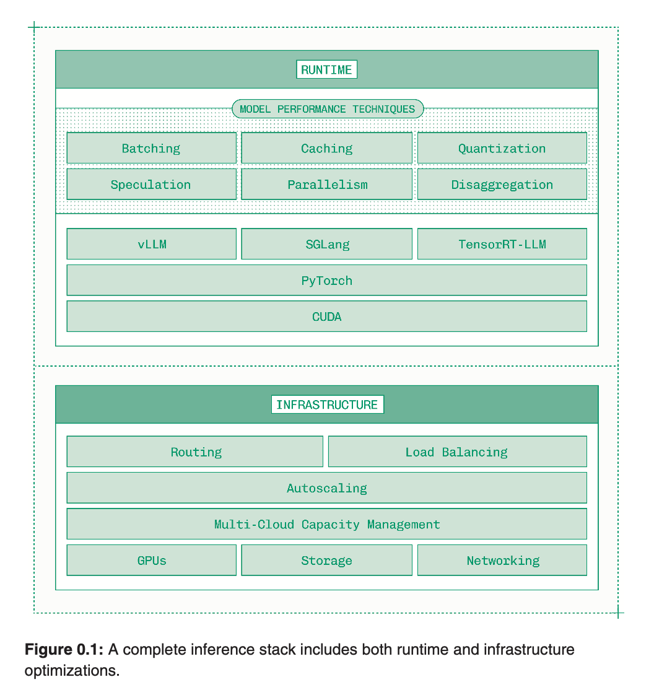
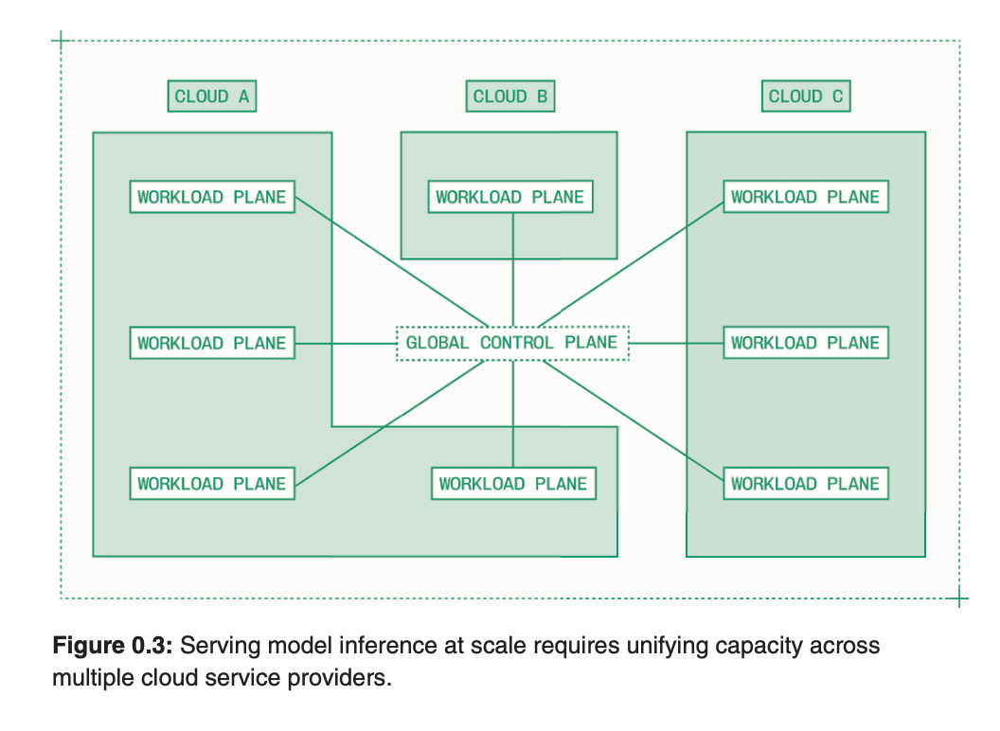
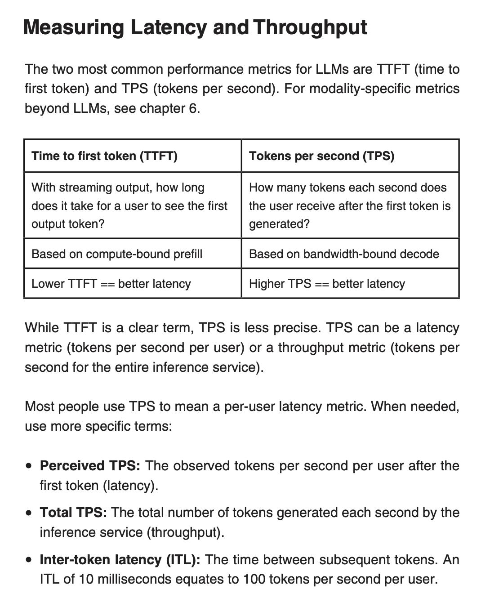

## Intro

Hey, i have a interview next week possibly for a pretty good indian company.
I am not too sure what they gonna ask or whats the role (a recuriting agency contacted me about it).

Hence in search of a good material, i ended up on this book about Inference Engineering by Philip Kiely.
This := [https://www.baseten.co/inference-engineering/](https://www.baseten.co/inference-engineering/)
This is my version and understanding of book with other materials and knowledge combined.

About 259 pages long, will try to cover up all in one night. They call me Aizen for a reason (no one calls
me that :sob: :sob: :wilted_rose:)

## Preface

Inference engineering is a pretty new work. Its mostly in context with the AI industry. Inference engineer's
work mostly move from CUDA to K8s, all in pursuit of fast, cheap and more reliable serving of gen AI models.

If you wanna find gen AI models, you are welcomed to look at more than 2 million models on huggingface.
So a Closed model is some model those weights are not available to the general public. Open model means
its weigths are publicily available. Usually you have to give them some data to access it.

Opens models are pretty interesting case to be. As they have progressed over time, you can see people
fine tunning them to make them perform better on certain benchmarks, even exceeding closed model
capabilities.

Somethings Open models provide which are helpful:
* Latency: Closed models are built for throughput as they have to serve more people. Open models can be
tunned for latency so that it can be helpful for fast serving/real-time applications.
* Availability: One can check uptimes models have nowdays, with ones own, one can have 4-9's uptime.
* Cost: If utilized best, open models cost less at scale.

Alot of startups are moving to open models, even ernterprises are building of top of them. 

## Inference

In models world, inference is generally the second part. It comes after training of model.
Here is Llama 3.2 1B parameter model's paper you can take a read of to get insights in model
training from tensor to parallel pipelining

Paper := [https://arxiv.org/abs/2407.21783](https://arxiv.org/abs/2407.21783)

So usually:
* Training: A model learns here, all weights, segement training and so.
* Inference: Serving Gen AI models in production.

We will cover mostly Inference in this blog.
Inference requires 3 layers:
* Runtime: Runtime performance optimization.
* Infrastructure: Scaling across cluster, regions with good uptime.
* Tooling: Tools to make engineers productive.

The runtime layer depends on these factors for optimisation:

* Batching: Processing incoming request in parallel. Weaving them together on a token by token basis.
* Caching: Using a KV Cache to cache the results of the training algorithm.
* Quantization: Lowering the selected model pieces precision to have more compute and reduce memory burden.
* Speculation: Similar like speculative decoding. Having a small model predict tokens fast which can get
verified my the big model for fast speed.
* Parallelism: Using more GPU's.
* Disaggreagation: This is new ot me. Separate the two phases of LLM inference, prefill and
decode, onto independently scaling workers.

These extended from visual models to image/video generation, audio speech recognition, etc.
But this is for a particular instance runtime perforamnce. AS we scale, we need more ways to handle
traffic, maintain perforamcne, etc. As the book says, this is not a CUDA or pytorch problem, its more
of a systems problem that needs to be solved at infrastructure layer.

At past few hundred GPU's, infra problems are defined by capacity. Inference engineers generally
spread workloads across multiple regions and cloud providers.

Developer experience can vary. On one side it can be that one just provides some model weights and
gets an Api back (like serverless on Runpod). One the other hand it can be something like controling
everything from compute to infra, etc.

## Prerequisites

Inference engineering helps add scale and speed to the product. One needs to know according to his
business problem solution what needs to be done for your product to be the best. Its always finding
the right balance between what one needs and what needs to be done.

One's inference system must be designed to fulfill the specific demands of that particular model.

Few questions to ask:
* Model requirements: WHich model do you need to inference on?
* Application Interface: Input -> Model and Output -> ?
* Latency budget: How fast it should be ? Can we take some hit and help yourself in another area ?
* Unit economics: Spend on per request, per user, per month ?
* Usage patterns: Just like how markets usage fluctuate during the days, how's ours ?

Its recommned to use off the shell APIs at the start and start moving to dedicated inferences when
one's requirements start getting clear.

### Scale and Specialization

Two ways to add AI model to your product:
* Shared inference: Use a model's API given by its company and pay per million tokens as used
* Dedicated inference: For example rent out a GPU on Runpod, pay per hour and use it for by your pipeline.

Some reasons to go from Shared to Dedicated deployemnts is:
* Scaling: It gets more economical to host on your own due to enough traffic
* Specilisation: Fine tunes, lora adapters, etc
* Orchestration: Multiple steps, multiple models workflows can be optimized on latency and complexity.

For consumer apps, one should prioritize marginal cost and flexibility while keeping latency and
availability decent. For B2B, one must consider latency and uptime, then cost and scale.

One should select model wisely so that they dont spend waste time optimizing something which may not be helpful
in future. For this, one should do Model Evaluation. One can also fine tune small models and see
if it passes their evals. Inference on small models is generally faster as compared to big ones. Tasks could
be like convertion of Text to SQL.

Also, one should measure both end to end inference time as well as on-GPU time required to generate tokens.
This helps us know how our model performance is. 

## Models

sorry got busy, to be continued...
