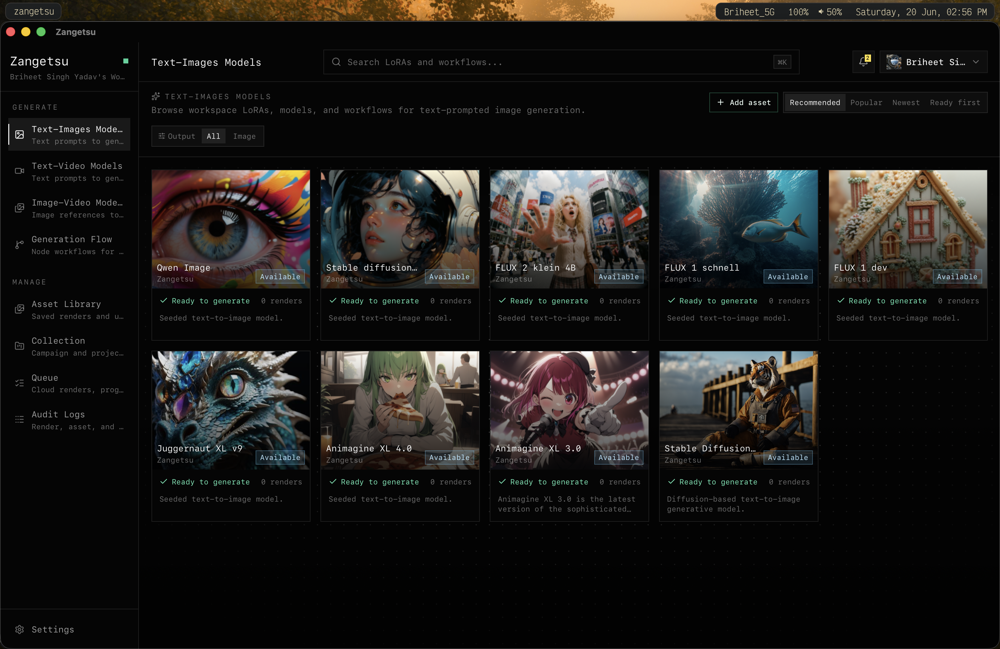
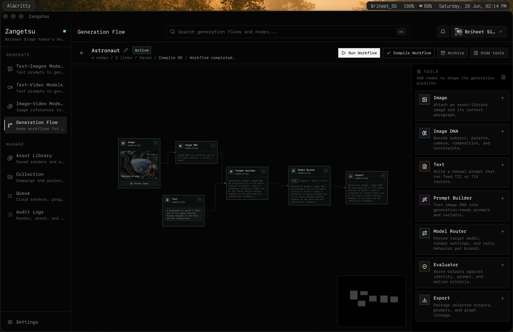
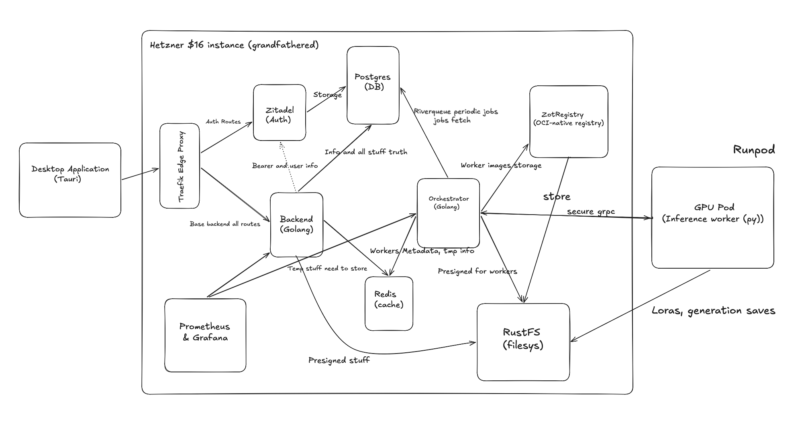
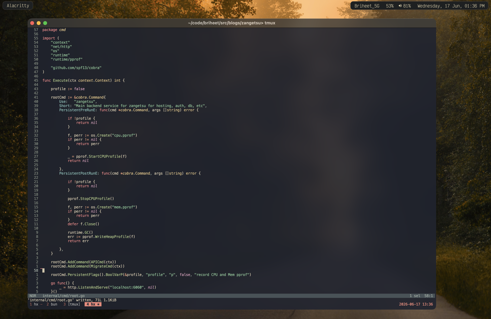
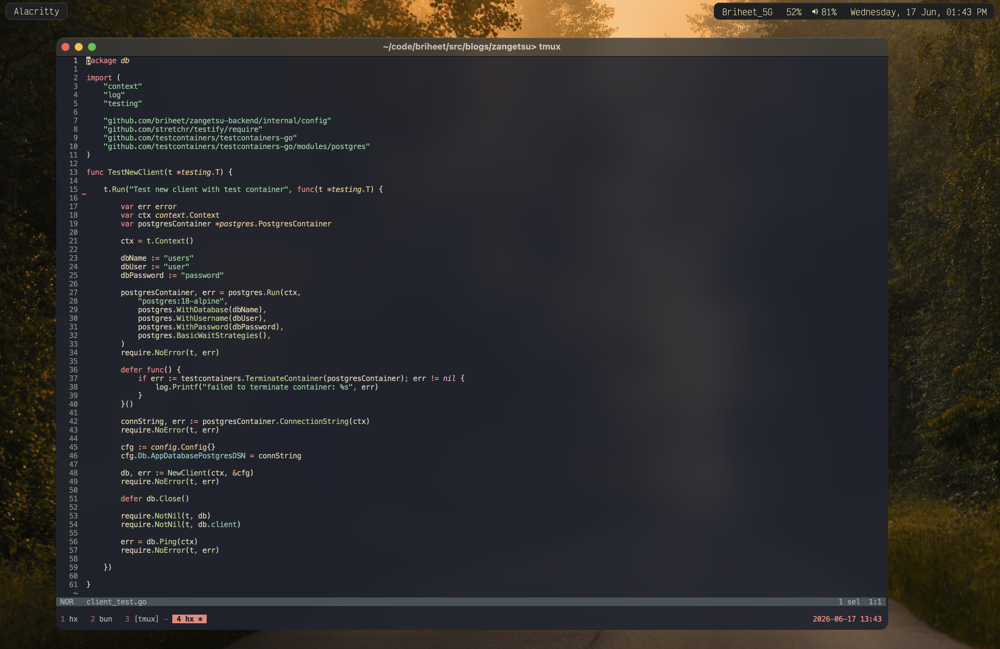
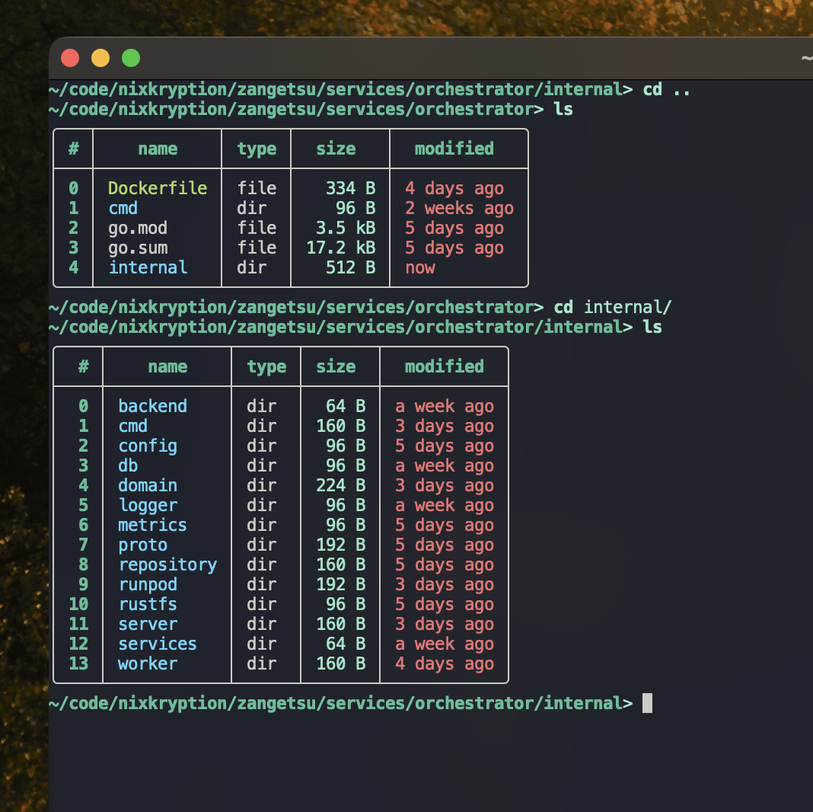
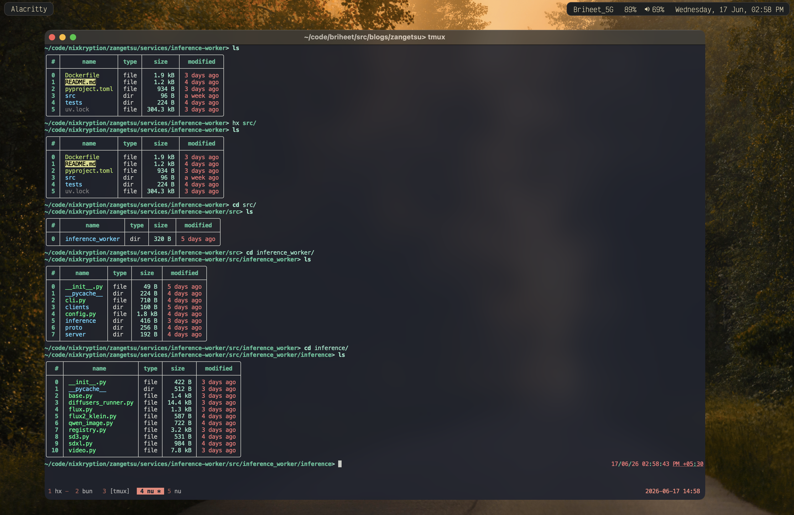
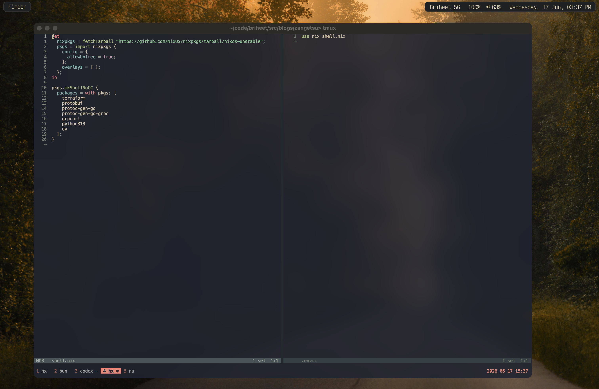

# Why I built Zangetsu ?

Hey there, how's it going ? \
I have been working with diffusion based adapters and workers for a while. \
Few of my friends were curious to as what they are and how can they generate media from them aswell.
There are a lot if places one can go, nanobana and multiple places. However most of they are either slow,
hard to keep track of generated media, costly, yade yade yada.



This prompted me to build something which is easy to use, doesn't cost that much, has a desktop based application
which is fast, small binary, performant and looks good aswell.
Hence i ended up building zangetsu. Below is the full architecture and design decision i took while building it.



# System Architecture

The architecture is pretty simple as i didnt want to spend much time on it and get it working asap. Here is the rough diagram.



As you can see looks a bit messy due to arrows and all. Sure can do better on this. Main components are Desktop based application written in Tauri,
Backend wirtten in golang with net/http, Orchestrator written in golang with grpc, inference worker written in python with diffusers,
supporting infra as postgres, rustfs (minio i miss you), redis, zitadel as auth, zot as image registry (worker images), traefik, promethus and grafana as observability.

# High Level and Components

On a high level, a person usually select a type of generation he wants by choosing a particular adapter.
A particular adapter can be of different types and different models. Current it support text-image, text-video and image-video.
So one goes to the generation page, inputs his prompt which is then sent to `Backend API`, from where is gets built as jobs with
number of generations, variations if so, and posted in postgres table.
The main scope of backend here is building jobs, frontend api infos, settings, workspaces, users queries, etc.

There is also a graph workflow page now. I treat it as another way to prepare render jobs, not as a replacement for the normal generation pages.

The job then gets picked up by `Orchestrator` by periodic jobs provided by `Riverqueue` which polls searching for pending jobs
in DB (i know this is bad and should be an event maybe use nats here would be a right choice but its just a operational overhead
as compared to something that is required here).

Now its info is picked, does a lot of checks. To save money, this system uses model based jobs allocation. Diffusers library provides us
with hotswapping loras which is quite nice. Hence we can have a model runnning on a pod, which loras and generate media rather than
having to start a new runpod worker which if RTX 5090 would cost us $1 dollar an hour more.

So yea we use Runpod's API, our image gets pulled via Zot registry which uses RustFS as storage. Image pulling and running on runpod which
takes about 200 mb/sec speed on our 4.2 gb docker image. As huggingface models are cached on runpod we dont usually have to pay the cold
start price for it but yea its still slow due to image pulling. I have detailed more on this in the inference section.

Pulling in loras, doing a warmup of pipeline and sending a conn to orchestrator via inference worker and sending the status to ready.
After generation, all generated media is stored in RustFS via presigned url and made available to application.

# Components in detail and decision

## Edge and Authentication

Traefik is sitting at the edge as a reverse proxy. It routes auth traffic to Zitadel and backend traffic to the Go API.
Zitadel handles login through OIDC. The app talks to Zitadel directly for login, gets a token, then sends that token to the backend.
Backend does not do password auth. It only validates the bearer token and then checks Zangetsu workspace permissions.


## Backend API

Backend is a simple service written in Go. Its a simple `Cobra` based cli which has commands for API, postgres migrations.


At base it is a `Domain - Repository` pattern. I havent had any issues so far with it. Lets me easily swap between different different implementation
rather than being fixed on one. Its also pretty nice as one cannot lock himself or has to do a lot of rewriting when adding a new
service or component. For migrations i use `golang migrate`.


I am a test driven person so it helps injecting dependencies with ease. All tests are mostly written with
`TestContainers`. I find it really easy and nice to have. One can easily apply all migrations and state, have a snapshot and retrieve it in another test.
Thats it, backend usually deals with Accounts, Workspace, Catalogue, Render, Assets, Collections routes, etc. I use `uber/zap` for our logger.

It also has APIs for graph workflows now. The graph run does not have a separate render system. A Model Router node still creates a normal render job,
so the same queue, orchestrator and worker path gets used.

There is a prompt enhancement API aswell. The frontend sends a rough prompt from text-image, text-video or image-video page,
and backend returns a cleaner generation prompt. I kept this behind the backend so the desktop app does not need to know any model/provider secrets.

Models can also be seeded now. The model list lives in `services/backend/config.toml`, previews live inside `services/backend/data/models`,
and docker compose has a `backend-seed` job. Seeded models are global models, so a user does not need to upload the same base models again and again.

## Generation Flow

Generation Flow is basically a node canvas for the times when one prompt box feels too small.
It has nodes like `Image`, `Image DNA`, `Text`, `Prompt Builder`, `Model Router`, `Evaluator` and `Export`.

The normal generation pages are still the fastest path. This graph page is more for chaining context together.
For example, an image plus a small paragraph can go into Image DNA, then Prompt Builder, then a Model Router.
Before running, the graph gets compiled so broken flows fail early instead of becoming weird render jobs.

## Orchestrator

I wanted something which is lightweight, stateless, can go down and still recover state. Hence i ended up adding an Orchestrator to the stack.

Its written in golang, has worker given by `Riverqueue`. It uses riverqueue Postgres to poll queued jobs.
When it finds one, it checks what model and GPU profile is needed. If an idle pod already matches the model,
it reuses it. If not, it asks Runpod to create a new pod with the worker image.
This matters because cold starts are expensive. Reusing a pod that already has the model loaded saves time and money.
Also same model different loras still go to the same pod to make it less expensive. Makes me save alot of money.

I asked a few people on Golang's discord and a few seniors, they either suggested me to have a source of truth or add a `shim` process
by it. But i think having a ditributed lock or shim would be a bit overkill for this product until we want to scale this as an product.


## Data, Object Store and Auth

We have `Postgres` and our source of truth. It is paired with `PgAdmin`. It stores all user data, catalogue, render jobs, generations, etc.
RustFS is used for the heavy stuff: uploaded files, LoRAs, references, previews and generated outputs. I mostly use presigned urls.
Till now i have used almost all from s3 to digital ocean spaces to minio to dynamodb.

Uploads to asset library also carry a small description now. Generated assets already have the prompt which created them.
This is useful for graph flows because an image is not just pixels there. It also has text context attached to it.

I wanted to self host this to keep costs down for now hence first choice was minio but the maintenance mode got me.
Hence i tried using RustFS and it hasnt caused any problems till now.
I have a job running for taking postgres dumps everyday via `pg_dump`. I was thinking to keep backups at BackBlaze but nah.

For Auth, as people say its quite not good to write your own auth. Hence i ended up with Zitadel. Its nice and simple to use. No issues so far.
You can write its infra via `terraform`. Check Zitadel's website for more.


## Inference Worker Runtime (py, zig ?)

The inference worker is Python because diffusion tooling is best there. The code is mostly a Click cmd WorkerRuntime. 
When the worker starts, it connects back to the orchestrator over secure gRPC and says it is ready. The orchestrator then sends it one render job.

The worker downloads LoRAs and input assets using presigned URLs, loads or reuses the model pipeline, runs inference, uploads output files, and reports progress back.
Worker does not touches Postgres. Worker does not get long-lived storage keys. Worker just does the GPU work.

I also added more model paths here while testing video generation. Wan, Hunyuan, SkyReels, LTX and SVD like models all need slightly different pipeline code.
The worker image is pinned around CUDA 12.8 / Torch 2.7 because video models are quite picky about runtime.



I did use optimum-cli to get onnx but it was will onnx be cached on runpod ? It has a community but i dont know, i will try after sometime thoo.


## Observability

There is Prometheus and Grafana for metrics.
Backend exposes HTTP and DB metrics. Orchestrator exposes queue, worker, Runpod and gRPC metrics.

I mainly care about a few things:
- is the API healthy?
- is the render queue growing?
- are workers connecting?
- are pods slow to start?
- are renders failing?

I never worked much on observability in detail so yea that was it.

## Tooling and dependencies

Tooling wise i mostly used were `nix` paired with `direnv`. Editor is `Helix` terminal is `Alacritty`.
I don't like installing random tools globally for every project, so the repo has a small `shell.nix` with the things needed to work on it.
Although i have a flake named tools in my `nix-darwin home-manager` setup having all the tools it required, i did use direnv mostly for this.
My `.envrc` and `shell.nix` is basically 



# Things i'd improve or change

I think i over did with grpc as in worker. Could've been websockets but i think its fine i am quite comfortable with it.
Pod cleanup and stale worker reconciliation can also get better. GPU systems fail in boring ways, so the cleanup jobs also need to be boring and reliable.

I think as a product on-demand pods are the worst. If want to scale this up i would definitely talk to someone for broker a deal
and having reduced cold starts. I first thought it would be nice with onnx and network volume, can have a small zig binary
which will let me reduce cold starts by a lot. But the thing is network volume on runpod is datacenter specific.
Most of my generations are on 3090, 4090, 5090 and L40s. Having all available on demand at a particular datacenter in runpod is
impossible. I also thought maybe dedicating particular work for particular gpu's in a specific datacenter with network volume will fix this
but i am not sure this will be good for max 30 people usage. I also looked into serverless but its cost's are quite high.

There is a lot of places over the network things will go weird. I remember RTX 5090 was not able to pull docker image even for 15 minutes.
The thing is one cannot depend on anything externally to be stable. There should always be ways to counter fails and fix them.

I think this problem has been famous in dependencies wars aswell. I think zig paired with tigerstyle.dev (by tigerbeetle) approach does the best for a software.
Although i am yet to be that knowledgable enough.

One thing I want to add next is fuzzing around the system boundaries. Not fuzz the whole app,
but the places where inputs enters: render job payloads, file uploads, worker gRPC events, checksums, storage keys and Runpod responses.
This should help catch boring but painful bugs like invalid render settings, bad filenames,
wrong checksums, broken worker events, missing output refs and payloads that pass API validation but fail later in the worker/orchestrator.

I have been reading whatever i could find for distributed simulation testing.
I also want to add it around the render pipeline. This should catch lifecycle bugs like stuck jobs,
duplicate completions, stale pods, worker disconnects, and scheduler races before they show up in production.

On product side, graph workflow still has a lot to improve. Real Image DNA should probably come from a vision model,
there should be better run history, and rerunning from a middle node would be nice instead of always thinking of the graph as one full run.

The current deployment is via container. I would like to shift this to a systemd via nixos-anywhere and deploy-rs.

I would also rewrite worker as zig inference with onnx or candle-rs that's Rust, but thats a personal project.I dont really find python
any intutive. Coming from Go, Rust and Zig, its one of the worst things i wrote. I think programming golang for so long i kept reaching out for
```go
if err != nil {
  // do something
}
```
in my code in places where i think it should've been. Also i dont know its tooling is not that good.
I tried accessing its lsp stuff but found it quite bad. I was always reaching for source code to read info.

Riverqueue is quite good, but i think writing my own worker would've been good. Riverqueue attaches to postgres
and one does Riverqueue migrations to setup its tables in Postgres.

Also i got this : )

